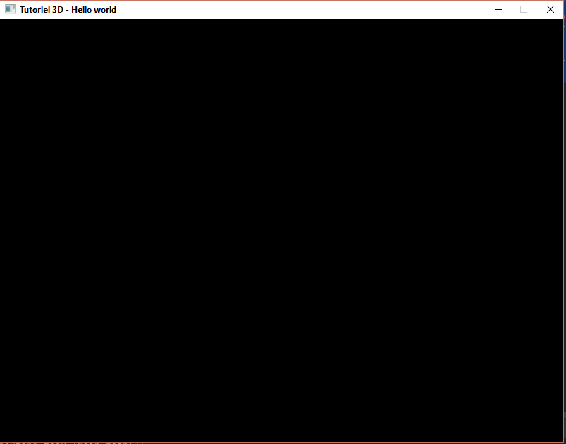
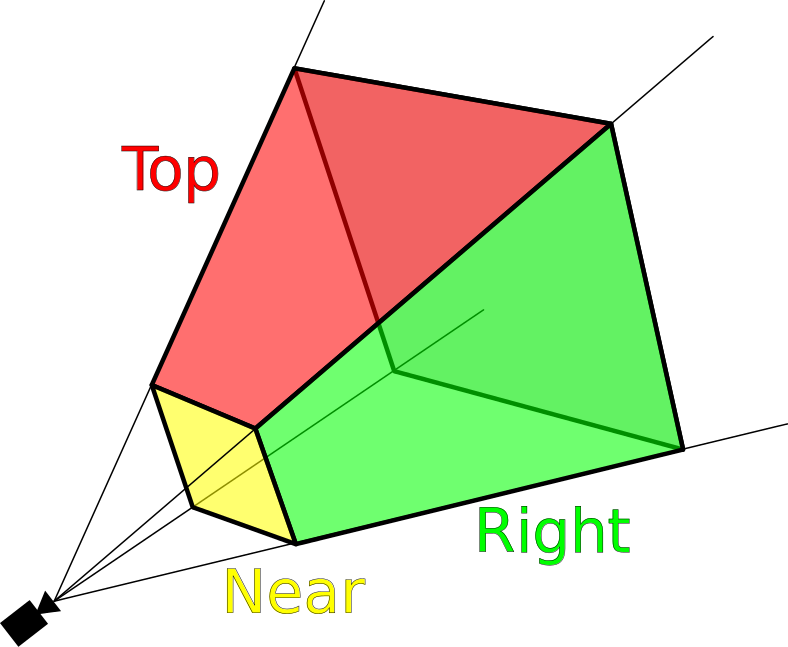
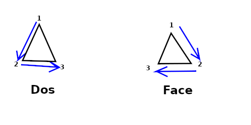
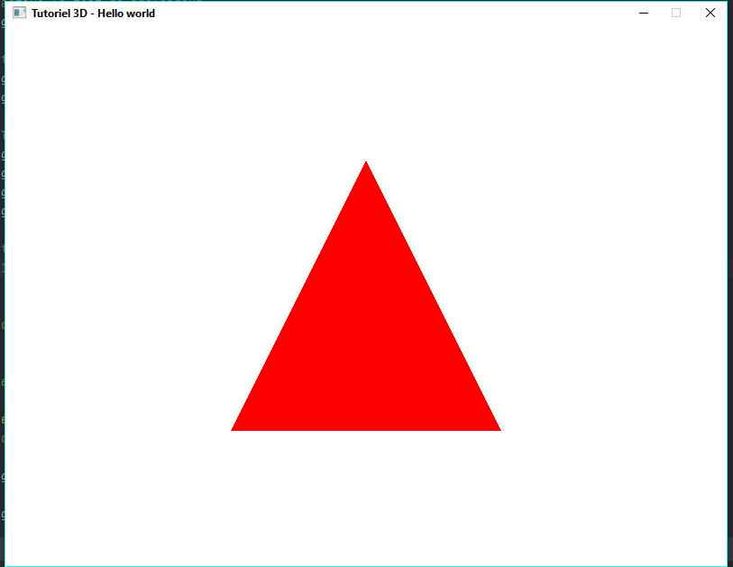

# Création d'un "Hello world"

Nous supposons ici que vous ayez configuré votre environment de travail, si ce n'est pas le cas référez-vous à :
[Créer un environment de travail](Introduction.md#crer-un-environnement-de-travail)

Comme nous n'alons dit dans l'introduction, le thread OpenGL est extémement import. Il doit s'y effectuer toutes les commandes OpenGL et seulement celles-ci afin de ne pas nuir à l'affichage.
Afin de se rappeler qu'une méthode s'exécute dans le Tthread OneGL, nous créons une annotation à mettre à la déclaration de ces méthodes

```java
package fr.developez.tutorial.java.dimension3.tool;

import java.lang.annotation.Documented;
import java.lang.annotation.ElementType;
import java.lang.annotation.Retention;
import java.lang.annotation.RetentionPolicy;
import java.lang.annotation.Target;

@Retention(RetentionPolicy.SOURCE)
@Target(ElementType.METHOD)
@Documented
public @interface ThreadOpenGL
{
}
``` 

## Fenêtre d'affichange

Avant de pouvoir afficher la 3D à l'écran, il nous faut une fenêtre dans laquelle celle-ci sera dessinée.
Nous allons donc commencè par créer cette fenêtre.

Pour cela nous allons utiliser `GLFW`

Une chose à comprendre sur le GLFW et l'OpenGL, c'est que le Thread qui va initialiser la fenêtre doit être le même que celui qui sera utilisé pour faire le rendu OpenGL.
Nous l'appeleront le Thread OpenGL.

Dans ce Thread on ne doit faire que du rendu, tous les listeners que nous appellerons seront dans un Thread à part.

Ceci est important pour garder la fluidité du rendu. Un développeur utilisant notre fenêtre, ne devra jamais pouvoir ou devoir utiliser ce Thread directement.
Cela évitera pas mal d'erreurs et des problèmes de rendu.

```java
package fr.developez.tutorial.java.dimension3.render;

import fr.developez.tutorial.java.dimension3.tool.NonNull;
import fr.developez.tutorial.java.dimension3.tool.Tools;
import fr.developez.tutorial.java.dimension3.tool.ThreadOpenGL;

public class Window3D
{
    public final  int                  width;
    public final  int                  height;
    public final  String               title;

    public Window3D(int width, int height, @NonNull String title)
    {
        Tools.checkNotNull("title", title);

        // Évitons les fenêtres trop petite
        this.width  = Math.max(128, width);
        this.height = Math.max(128, height);
        this.title  = title;

        // Création et lancement du Thread OpenGL
        (new Thread(this::startOpenGLThread)).start();
    }

    @ThreadOpenGL
    private void startOpenGLThread()
    {
        // TODO Initialiser la fenêtre, la lier à OpenGL, l'afficher, lancer le rendu         
    }
}
```

La première chose à faire est de capturé les erreurs GLFW pour avoir des informations en cas de problèmes. 
Pour le moment, redirigeons ces erreurs sur la console.

```java
// ... 
import org.lwjgl.glfw.GLFWErrorCallback;
import fr.developez.tutorial.java.dimension3.tool.ThreadOpenGL;
// ...

public class Window3D
{
    // ....

    @ThreadOpenGL
    private void startOpenGLThread()
    {
        // Capture les erreurs LWJGL et les affichent sur la consoles
        // Une gestion de erreurs différente est possible, mais sort du tutoriel d'introduction
        GLFWErrorCallback.createPrint(System.err)
                         .set();

        // TODO Initialiser la fenêtre, la lier à OpenGL, l'afficher, lancer le rendu         
    }
}
```

On doit ensuite initialiser GLFW:

```java
// ... 
import org.lwjgl.glfw.GLFWErrorCallback;
import org.lwjgl.glfw.GLFW;
import fr.developez.tutorial.java.dimension3.tool.ThreadOpenGL;
// ...

public class Window3D
{
    // ....

    @ThreadOpenGL
    private void startOpenGLThread()
    {
        // Capture les erreurs LWJGL et les affichent sur la consoles
        // Une gestion de erreurs différente est possible, mais sort du tutoriel d'introduction
        GLFWErrorCallback.createPrint(System.err)
                         .set();

        if (!GLFW.glfwInit())
        {
            // On désinscrit la gestion d'erreurs puisque nous ne pouvons pas continuer
            GLFW.glfwSetErrorCallback(null)
                .free();
            System.err.println("GLFW initialisation failed");
            return;
        }

        // TODO Initialiser la fenêtre, la lier à OpenGL, l'afficher, lancer le rendu         
    }
}
```

Nous allons ensuite configurer la fenêtre. 
GLFW va nous donner une reference sur cette fenêtre. 
Cette référence devra être utilisée pour communiquer avec la fenêtre. 
Nous devons donc garder cette référence.
Cette référence est sous la forme d'un `long`

Note (Pour les plus curieux) :
> Cette valuer est ce qu'on appelle une référence opaque. C'est-à-dire quelque chose qui n'a pas de sens en Java. 
> Le développeur Java n'a pas à se soucier de ce qu'elle signifie vraiment, mais doit la garder telle qu'elle.
>
> Rappelons-nous ce qui a été dit dans l'introduction, en réalité nous parlons à une librairie en C/C++.
> Notre fenêtre, à sa création, sera référencé par un pointeur sur une adresse mémoire.
> Le `long` est la valeur de cette adresse. Il faut un `long` pour une adresse mémoire compatible à une architecture 64 bits.
> Et comme qui peut le plus, peut le moins, ça marche aussi sur des architectures 32 bits.
> 
> Ici nous ne préoccupons pas de ces détails, mais c'est toujours intéressant de savoir d'où viennent les choses.

```java
// ... 
import org.lwjgl.glfw.GLFWErrorCallback;
import org.lwjgl.glfw.GLFW;
import fr.developez.tutorial.java.dimension3.tool.ThreadOpenGL;
// ...

public class Window3D
{
    // ...
    /**
     * Reference sur la fenêtre permettant à GLFW de la gréée
     */
    private       long                 window;
    // ....
    
    @ThreadOpenGL
    private void startOpenGLThread()
    {
        // Capture les erreurs LWJGL et les affichent sur la consoles
        // Une gestion de erreurs différente est possible, mais sort du tutoriel d'introduction
        GLFWErrorCallback.createPrint(System.err)
                         .set();

        if (!GLFW.glfwInit())
        {
            // On désinscrit la gestion d'erreurs puisque nous ne pouvons pas continuer
            GLFW.glfwSetErrorCallback(null)
                .free();
            System.err.println("GLFW initialisation failed");
            return;
        }

        // Configure GLFW
        GLFW.glfwDefaultWindowHints();
        // On empêche, pour le moment, que la fenêtre s'affiche afin d'avoir le temps de la configurée
        GLFW.glfwWindowHint(GLFW.GLFW_VISIBLE, GLFW.GLFW_FALSE);

        // La fenêtre aura un contour
        GLFW.glfwWindowHint(GLFW.GLFW_DECORATED, GLFW.GLFW_TRUE);
        // La fenêtre ne pourra pas être redimensionnée
        // Un redimensionnement obligerait à écouter le changement de taille et à y réagir.
        // Comme nous voulons faire simple, nous ne gérons pas ce cas tout de suite
        GLFW.glfwWindowHint(GLFW.GLFW_RESIZABLE, GLFW.GLFW_FALSE);
        // On veut que la fenêtre fasse aau plus proche possible la dimension demandée
        GLFW.glfwWindowHint(GLFW.GLFW_MAXIMIZED, GLFW.GLFW_FALSE);

        // Create de la fenêtre
        this.window = GLFW.glfwCreateWindow(this.width, this.height, this.title, MemoryUtil.NULL, MemoryUtil.NULL);

        if (this.window == MemoryUtil.NULL)
        {
            // La fenêtre n'a pas pu être réservée en mémoire, on ne peut pas continuer
            this.closeGLFW();
            System.err.println("GLFW can't create window");
            return;
        }


        // TODO Initialiser la fenêtre, la lier à OpenGL, l'afficher, lancer le rendu         
    }

    /**
     * Appeler à la sortie de la fenêtre pour nettoyer proprement les divers états
     */
    private void closeGLFW()
    {
        // Termine la gestion de la fenêtre par GLFW
        GLFW.glfwTerminate();
        // Arrête de tracker les erreurs
        GLFW.glfwSetErrorCallback(null)
            .free();
    }
}
```

Maintenant que notre référence est créée,nous allons ajouter un listener qui va réagir au plus important événement : 
La fermeture de la fenêtre, afin de bien libéré la mémoire.

Pour cela créons une classe qui va réagir aux événements de la fenêtre :

 ```java
 package fr.developez.tutorial.java.dimension3.render;
 
 import org.lwjgl.glfw.GLFW;
 import org.lwjgl.glfw.GLFWWindowCloseCallbackI;
 
 class Window3DCloseEventManager
         implements GLFWWindowCloseCallbackI
 {
     /**
      * Appeler au moment qu'une fenêtre est sur la point de se fermée
      * @param window Référence sur la fenêtre entrain de se fermée
      */
     @Override
     public void invoke(long window)
     {
         this.closeWidow(window);
     }
 
     /**
      * Gère la fermeture d'une fenêtre 
      * @param window Référence sur la fenêtre a fermée
      */
     void closeWidow(long window)
     {
         // Pour le moment on autorise la fenêtre à se fermée dans tous les cas
         GLFW.glfwSetWindowShouldClose(window, true);
     }
 }
```

Plus d'informations sur `glfwSetWindowShouldClose` :
Il s'aggit d'un flag qui permet d'autoriser ou non la fermeture de la fenêtre. 
Le mettre à `true`, comme ici, va permettre la fermeture de celle-ci. 

Dans certains cas il peut être utile de le mettre à `false`pour par exemple afficher une boîte de dialogue qui demande :
"Êtes-vous sur de vouloir quitter ?"

Nous nous servirons également de ce flag, pour savoir quand arrêter la boucle rendue OpenGL.

Maintenant, nous pouvons brancher notre listener de fermeture.

```java
// ...
import org.lwjgl.glfw.Callbacks;
import org.lwjgl.glfw.GLFW;
import org.lwjgl.glfw.GLFWErrorCallback;
import fr.developez.tutorial.java.dimension3.tool.ThreadOpenGL;
// ...
public class Window3D
{
    // ...
    /**
     * Reference sur la fenêtre permettant à GLFW de la géréée
     */
    private       long                      window;
    private final Window3DCloseEventManager window3DCloseEventManager = new Window3DCloseEventManager();
    // ...

    @ThreadOpenGL
    private void startOpenGLThread()
    {
        // Capture les erreurs LWJGL et les affichent sur la consoles
        // Une gestion de erreurs différente est possible, mais sort du tutoriel d'introduction
        GLFWErrorCallback.createPrint(System.err)
                         .set();

        if (!GLFW.glfwInit())
        {
            // On désinscrit la gestion d'erreurs puisque nous ne pouvons pas continuer
            GLFW.glfwSetErrorCallback(null)
                .free();
            System.err.println("GLFW initialisation failed");
            return;
        }

        // Configure GLFW
        GLFW.glfwDefaultWindowHints();
        // On empêche, pour le moment, que la fenêtre s'affiche afin d'avoir le temps de la configurée
        GLFW.glfwWindowHint(GLFW.GLFW_VISIBLE, GLFW.GLFW_FALSE);

        // La fenêtre aura un contour
        GLFW.glfwWindowHint(GLFW.GLFW_DECORATED, GLFW.GLFW_TRUE);
        // La fenêtre ne pourra pas être redimensionnée
        // Un redimensionnement obligerait à écouter le changement de taille et à y réagir.
        // Comme nous voulons faire simple, nous ne gérons pas ce cas tout de suite
        GLFW.glfwWindowHint(GLFW.GLFW_RESIZABLE, GLFW.GLFW_FALSE);
        // On veut que la fenêtre fasse aau plus proche possible la dimension demandée
        GLFW.glfwWindowHint(GLFW.GLFW_MAXIMIZED, GLFW.GLFW_FALSE);

        // Create de la fenêtre
        this.window = GLFW.glfwCreateWindow(this.width, this.height, this.title, MemoryUtil.NULL, MemoryUtil.NULL);

        if (this.window == MemoryUtil.NULL)
        {
            // La fenêtre n'a pas pu être réservée en mémoire, on ne peut pas continuer
            this.closeGLFW();
            System.err.println("GLFW can't create window");
            return;
        }

        // TODO : Insérer ici les listeners pour les événements souris, clavier et joystick

        // Management de la fermeture de la fenêtre pour libéré proprement la mémoire
        GLFW.glfwSetWindowCloseCallback(this.window, this.window3DCloseEventManager);
        
        // ...
    }
    
    public void closeWindow()
    {
        this.window3DCloseEventManager.closeWidow(this.window);
    }

    void exitWidow()
    {
        // On libère tous les listeners
        Callbacks.glfwFreeCallbacks(this.window);
        // On finalize la destruction de la fenêtre
        GLFW.glfwDestroyWindow(this.window);
        // On ferme les événements GLFW
        this.closeGLFW();
    }

    /**
     * Appeler à la sortie de la fenêtre pour nettoyer proprement les divers états
     */
    private void closeGLFW()
    {
        // Termine la gestion de la fenêtre par GLFW
        GLFW.glfwTerminate();
        // Arrête de tracker les erreurs
        GLFW.glfwSetErrorCallback(null)
            .free();
    }
}
```

Nous avons ajouté une méthode pour pouvoir fermer la fenêtre à partir du code, ainsi que préparée la fermeture propre de la fenêtre.

En appelant `closeWidow` du listener, on s'assure de pouvoir gérer la fermeture de la fenêtre toujours au même endroit.
Ce qui évitera de dupliquer du code le moment ou l'on voudra ajouter une logique plus complexe à la fermeture.

Il ne nous reste à attacher le rendu OpenGL à la fenêtre, et préparé la boucle de rendue.

Tout d'abbord attachons OpenGL et montrons la fenêtre :

```java
// ... 
import org.lwjgl.glfw.Callbacks;
import org.lwjgl.glfw.GLFW;
import org.lwjgl.glfw.GLFWErrorCallback;
import fr.developez.tutorial.java.dimension3.tool.ThreadOpenGL;
// ...
public class Window3D
{
    // ...
    /**
     * Reference sur la fenêtre permettant à GLFW de la géréée
     */
    private       long                      window;
    private final Window3DCloseEventManager window3DCloseEventManager = new Window3DCloseEventManager();
    // ...

    @ThreadOpenGL
    private void startOpenGLThread()
    {
        // Capture les erreurs LWJGL et les affichent sur la consoles
        // Une gestion de erreurs différente est possible, mais sort du tutoriel d'introduction
        GLFWErrorCallback.createPrint(System.err)
                         .set();

        if (!GLFW.glfwInit())
        {
            // On désinscrit la gestion d'erreurs puisque nous ne pouvons pas continuer
            GLFW.glfwSetErrorCallback(null)
                .free();
            System.err.println("GLFW initialisation failed");
            return;
        }

        // Configure GLFW
        GLFW.glfwDefaultWindowHints();
        // On empêche, pour le moment, que la fenêtre s'affiche afin d'avoir le temps de la configurée
        GLFW.glfwWindowHint(GLFW.GLFW_VISIBLE, GLFW.GLFW_FALSE);

        // La fenêtre aura un contour
        GLFW.glfwWindowHint(GLFW.GLFW_DECORATED, GLFW.GLFW_TRUE);
        // La fenêtre ne pourra pas être redimensionnée
        // Un redimensionnement obligerait à écouter le changement de taille et à y réagir.
        // Comme nous voulons faire simple, nous ne gérons pas ce cas tout de suite
        GLFW.glfwWindowHint(GLFW.GLFW_RESIZABLE, GLFW.GLFW_FALSE);
        // On veut que la fenêtre fasse aau plus proche possible la dimension demandée
        GLFW.glfwWindowHint(GLFW.GLFW_MAXIMIZED, GLFW.GLFW_FALSE);

        // Create de la fenêtre
        this.window = GLFW.glfwCreateWindow(this.width, this.height, this.title, MemoryUtil.NULL, MemoryUtil.NULL);

        if (this.window == MemoryUtil.NULL)
        {
            // La fenêtre n'a pas pu être réservée en mémoire, on ne peut pas continuer
            this.closeGLFW();
            System.err.println("GLFW can't create window");
            return;
        }

        // TODO : Insérer ici les listeners pour les événements souris, clavier et joystick

        // Management de la fermeture de la fenêtre pour libéré proprement la mémoire
        GLFW.glfwSetWindowCloseCallback(this.window, this.window3DCloseEventManager);
        
        // Associe le context OpenGL à la fenêtre
        GLFW.glfwMakeContextCurrent(this.window);
        // Activation du mode v-sync
        GLFW.glfwSwapInterval(1);

        // Maintenant que tout est configurer la fenêtre peut se montrée
        GLFW.glfwShowWindow(this.window);

        // Cette appel est crucial pour que la management d'OpenGL avec GLFW se passe bien
        GL.createCapabilities();

        // TODO Boucle de rendue
    }
}
```

## Boucle de rendue

Le role de la boucle de rendue est dans l'ordre :
1. Initialiser OpenGL avec les options que l'on désire utiliser
1. Rafraichir l'affichage en boucle tant que le fenêtre est présente
1. Quitter proprement l'application quand l'utilisateur demande la fermeture de la fenêtre

Voici son état minimal :
 
 ```java
package fr.developez.tutorial.java.dimension3.render;

import fr.developez.tutorial.java.dimension3.tool.NonNull;
import fr.developez.tutorial.java.dimension3.tool.Tools;
import org.lwjgl.glfw.GLFW;
import org.lwjgl.opengl.GL11;
import fr.developez.tutorial.java.dimension3.tool.ThreadOpenGL;

class Render3D
{
    private final Window3D window3D;
    private final long     window;

    Render3D(@NonNull Window3D window3D, long window)
    {
        Tools.checkNotNull("window3D", window3D);
        this.window3D = window3D;
        this.window   = window;
    }

    @ThreadOpenGL
    public void rendering()
    {
        this.initialize3D();

        // Tant que la fenêtre est présente, rafraichir la 3D
        while (!GLFW.glfwWindowShouldClose(this.window))
        {
            // Nettoyage de la fenêtre en buffer pour la prochaine frame
            GL11.glClear(GL11.GL_COLOR_BUFFER_BIT | GL11.GL_DEPTH_BUFFER_BIT);

            // Dessine la frame courante
            this.drawScene();

            // Rend la fenêtre en buffer dessinée visible à l'écran
            GLFW.glfwSwapBuffers(this.window);

            // Récupération des événements fenêtre arrivée peandant le dessin de la frame.
            // Les listeners sur les événements claviers seront appelée par cette méthode
            GLFW.glfwPollEvents();

            // TODO traité les évènements survenus
        }

        // La fenêtre de rendu se ferme ou est fermée, on quitte tout proprement
        this.window3D.exitWidow();
    }

    @ThreadOpenGL
    private void initialize3D()
    {
        // TODO
    }

    /**
     * Dessine la scène 3D
     */
    @ThreadOpenGL
    private void drawScene()
    {
        // TODO
    }
} 
```

Explications:

On remarque tout d'abbord que l'on boucle sur : `glfwWindowShouldClose`
Ce qui permet d'arréter la boucle de rendue dès qu'une requête est faite.

Pour comprendre le contenu de la boucle, il faut s'avaoir que le rendu à l'écran n'est, en réalité pas continu. 
OpenGL passe par une technique dite de double buffer.

Cette technique consiste à calculer l'image en mémoire, puis une fois prête l'affichée à l'écran. 
Afin d'économisez de la mémoire (et du temps de création), il joue avec deux buffers. L'un afficher à l'écran, l'autre en mémoire.
Et quand l'image en mémoire est prête, il échange les deux buffers. 

À noter que les cartes plus performantes peuvent gérer plus de deux buffers, mais le principe reste le même.

Ce qui fait que le buffer que l'on a pour travailler n'est pas un page vierge mais contient les informations d'un précédent calcul.
C'est pour cela que la première chose que l'on fait est de tout nettoyer afin d'être sûr de ne pas avoir d'artéfacts des calculs précédents.
On pourrait se demander pourquoi le buffer n'est pas nettoyer automatiquement. 
En fait pour certains effets il peut être utile de ne pas le nettoyer ou seulement en partie.
 
Un buffer contient non seulement les informations de couleur des pixels à dessiner, mais également des informations sur la profondeur calculées.
C'est pour cela qu'ici on nettoie les informations de couleurs et de profondeur, avec `GL11.glClear(GL11.GL_COLOR_BUFFER_BIT | GL11.GL_DEPTH_BUFFER_BIT)`

L'instruction `glfwSwapBuffers` permet de dire à la carte graphique que l'on a fini de dessiner et qu'elle peut échanger les buffers.
 
`glfwPollEvents` va remplir les informations sur les événements survenu pendant le rendu, 
ce qui nous sera utile quand nous réagiront aux événements souris, clavier, manette de jeu.
 
À la fin de la boucle, on n'oublie pas de fermer proprement la fenêtre.  

Il ne nous reste plus qu'a appeler notre boucle de rendu dans la fenêtre :

```java
// ... 
import org.lwjgl.glfw.Callbacks;
import org.lwjgl.glfw.GLFW;
import org.lwjgl.glfw.GLFWErrorCallback;
import org.lwjgl.opengl.GL;
import fr.developez.tutorial.java.dimension3.tool.ThreadOpenGL;
// ...
public class Window3D
{
    // ...
    /**
     * Reference sur la fenêtre permettant à GLFW de la géréée
     */
    private       long                      window;
    private final Window3DCloseEventManager window3DCloseEventManager = new Window3DCloseEventManager();
    private       Render3D                  render3D;
 
    // ... 
    @ThreadOpenGL
    private void startOpenGLThread()
    {
        // Capture les erreurs LWJGL et les affichent sur la consoles
        // Une gestion de erreurs différente est possible, mais sort du tutoriel d'introduction
        GLFWErrorCallback.createPrint(System.err)
                         .set();

        if (!GLFW.glfwInit())
        {
            // On désinscrit la gestion d'erreurs puisque nous ne pouvons pas continuer
            GLFW.glfwSetErrorCallback(null)
                .free();
            System.err.println("GLFW initialisation failed");
            return;
        }

        // Configure GLFW
        GLFW.glfwDefaultWindowHints();
        // On empêche, pour le moment, que la fenêtre s'affiche afin d'avoir le temps de la configurée
        GLFW.glfwWindowHint(GLFW.GLFW_VISIBLE, GLFW.GLFW_FALSE);

        // La fenêtre aura un contour
        GLFW.glfwWindowHint(GLFW.GLFW_DECORATED, GLFW.GLFW_TRUE);
        // La fenêtre ne pourra pas être redimensionnée
        // Un redimensionnement obligerait à écouter le changement de taille et à y réagir.
        // Comme nous voulons faire simple, nous ne gérons pas ce cas tout de suite
        GLFW.glfwWindowHint(GLFW.GLFW_RESIZABLE, GLFW.GLFW_FALSE);
        // On veut que la fenêtre fasse aau plus proche possible la dimension demandée
        GLFW.glfwWindowHint(GLFW.GLFW_MAXIMIZED, GLFW.GLFW_FALSE);

        // Create de la fenêtre
        this.window = GLFW.glfwCreateWindow(this.width, this.height, this.title, MemoryUtil.NULL, MemoryUtil.NULL);

        if (this.window == MemoryUtil.NULL)
        {
            // La fenêtre n'a pas pu être réservée en mémoire, on ne peut pas continuer
            this.closeGLFW();
            System.err.println("GLFW can't create window");
            return;
        }

        // TODO : Insérer ici les listeners pour les événements souris, clavier et joystick

        // Management de la fermeture de la fenêtre pour libéré proprement la mémoire
        GLFW.glfwSetWindowCloseCallback(this.window, this.window3DCloseEventManager);

        // Associe le context OpenGL à la fenêtre
        GLFW.glfwMakeContextCurrent(this.window);
        // Activation du mode v-sync
        GLFW.glfwSwapInterval(1);

        // Maintenant que tout est configurer la fenêtre peut se montrée
        GLFW.glfwShowWindow(this.window);

        // Cette appel est crucial pour que la management d'OpenGL avec GLFW se passe bien
        GL.createCapabilities();

        //Lancement du rendu OpenGL
        this.render3D = new Render3D(this, this.window);
        this.render3D.rendering();
    }
    // ...
}
```

Désormais tout est prêt pour l'affichage. Si on lance un "main" :

```java
package fr.developez.tutorial.java.dimension3;

import fr.developez.tutorial.java.dimension3.render.Window3D;

public class Main
{
    public static void main(String[] args)
    {
        final Window3D window3D = new Window3D(800, 600, "Tutoriel 3D - Hello world");
    }
}
```

On a une fenêtre vide noire prête à accueillir notre scène 3D :



## Initialisation de l'OpenGL 

Cette initialization va nous permettre de régler les divers aspects généraux de notre 3.
Comme la taille du frustum (voir l'introduction)



Le rectangle dans la fenêtre où dessiner la 3D, ici toute la fenêtre. Mais grace à cela il est possible de montrer facilement plusieurs vues de la scène ou des différentes scénes.
Cela sort du cadre du tutoriel.

Afin de simplifier certains calculs, ce tutoriel fournit l'outil GLU (Récupéré de JOGL)

```java
package fr.developez.tutorial.java.dimension3.render;

import fr.developez.tutorial.java.dimension3.tool.GLU;
import fr.developez.tutorial.java.dimension3.tool.NonNull;
import fr.developez.tutorial.java.dimension3.tool.ThreadOpenGL;
import fr.developez.tutorial.java.dimension3.tool.Tools;
import org.lwjgl.glfw.GLFW;
import org.lwjgl.opengl.GL11;
import org.lwjgl.opengl.GL12;

class Render3D
{
    private final Window3D window3D;
    private final long     window;

    // ... 

    @ThreadOpenGL
    private void initialize3D()
    {
        final int width  = this.window3D.width;
        final int height = this.window3D.height;

        // *** Gestion de la transparence ***
        // On indique que l'on souhaite activé la tranparence
        GL11.glEnable(GL11.GL_ALPHA_TEST);
        // Spécification de la précision de la transparence
        GL11.glAlphaFunc(GL11.GL_GREATER, 0.01f);
        // Façon dont la transparence est calculée
        GL11.glBlendFunc(GL11.GL_SRC_ALPHA, GL11.GL_ONE_MINUS_SRC_ALPHA);

        /// *** Apparence globale ***
        // Les matériaux peuvent être colorés
        GL11.glEnable(GL11.GL_COLOR_MATERIAL);
        // Pour des raisons de performances, on désactive les textures de manière globale, on les activera au cas par cas
        GL11.glDisable(GL11.GL_TEXTURE_2D);
        // On active la possibilité de combiné des effets
        GL11.glEnable(GL11.GL_BLEND);

        // ** Réglage de la perspective  ***
        // On fixe le rectangle de la fenêtre où la 3D sera dessinée.
        // Ici on veut dessiner sur toute la fenêtre
        // Sur le "frustum", c'est la zone proche de l'utilisateur
        // S'appel aussi 'view port'
        GL11.glViewport(0, 0, width, height);
        // On veut une projection normalisée
        GL11.glEnable(GL11.GL_NORMALIZE);

        // Réglage de la projection
        GL11.glMatrixMode(GL11.GL_PROJECTION);
        GL11.glLoadIdentity();
        final double ratio = (double) width / (double) height;
        GLU.gluPerspective(45.0, ratio, 0.1, 5000.0);
        // Réglage du model de la vue
        GL11.glMatrixMode(GL11.GL_MODELVIEW);
        GL11.glLoadIdentity();

        // Au départ on met un écran blanc
        GL11.glClearColor(1f, 1f, 1f, 1f);
        //On active le test de profondeur
        GL11.glEnable(GL11.GL_DEPTH_TEST);

        // Active les face visible que d'un coté (Pour éviter de dessiner des choses qui seront toujours cachés)
        GL11.glEnable(GL11.GL_CULL_FACE);
        GL11.glCullFace(GL11.GL_FRONT);

        // Éclairage de base pour un effet agréable
        GL11.glLightModeli(GL11.GL_LIGHT_MODEL_LOCAL_VIEWER, GL11.GL_TRUE);
        GL11.glShadeModel(GL11.GL_SMOOTH);
        GL11.glLightModeli(GL12.GL_LIGHT_MODEL_COLOR_CONTROL, GL12.GL_SEPARATE_SPECULAR_COLOR);
        GL11.glLightModeli(GL11.GL_LIGHT_MODEL_TWO_SIDE, 1);

        // Active l'éclairage
        // GL11.glEnable(GL11.GL_LIGHTING);
    }
    // ...
}
```

L'important à comprendre dans cette initialization:
* `GL11.glViewport(0, 0, width, height)` fixe le view port. c'est à sire la zone dans la fenêtre où la 3D sera dessinée. 
  Ici on prend toute la fenêtre.
* `GLU.gluPerspective(45.0, ratio, 0.1, 5000.0)` va créer le frustum. 
  * La première valeur, correspond à l'angle que fait visuellement l'axe des Z par rapport à l'axz des X. 
    L'aspect le plus naturel est 45 dégré.
  * La seconde valeur est la proportion largeur par rapport à la hauteur.
    Ici réglée pour que les proportions soit homogènes.
  * La troisième valeur est la distance du plan le plus proche du frustum
  * La dernière valeur est la distance du plan le plus éloigné du frustum

Une face a deux cotées, l'un dit de face, l'autre de dos. 
Pour déterminer si une face est de face ou de dos, OpenGL regarde l'odre dans lequel sont spécifié les points du polygones.

Si quand on les regarde, la definition des points spécifiés sont dans le sens des aiguilles d'une montre, alors on voit la face de la face.

Si quand on les regarde, la definition des points spécifiés sont dans le sens contraire des aiguilles d'une montre, alors on voit le dos de la face.

 

`GL11.glEnable(GL11.GL_CULL_FACE);`, indique que l'on souhaite distinguer le sens des face (savoir si on les regarde de face ou de dos)

`GL11.glCullFace(GL11.GL_FRONT);`, indique de ne calculer et dessiner que les faces de face et ignorées celles de dos.

L'intérêt de ce réglage est pour les objets dont on ne voit jamais l'intérieur comme les boîtes, les spheres, ...
On évite ainsi qu'OpenGL calcule les faces intérieures qui seront de toute façons cachées par des faces extérieures.  

Nous mettons, pour le moment `GL11.glEnable(GL11.GL_LIGHTING);` en commentaire afin de ne pas activer l'écairage.
Quand nous auront appris comment l'écalirage fonctionne, nous réactiverons cette ligne

## Dessinons un triangle rouge

Pour finir cet "Hello word", nous allons dessiner un triangle rouge

Nous verrons dans le chapitre suivant la notion de graphe de scène (scene graph en Anglais) et comment le mettre en place.

Pour l'instant, nous allons juste dessiner notre tringle directement dans la boucle de rafraichissement du trhread OpenGL.

À chaque tour de la boucle on redessine le triangle.

Comme nous l'avons vu dans l'introduction, les couleurs sont des valeurs d'intensité de rouge, vert et bleu. Avec un notion de transparence. 
Ici on veut du rouge, donc le rouge à fond, pas de bleu, pas de vert, et une couleur opaque. 
Il existe plusieurs façons de spécifier une couleur en OpenGL. 
Ici nous prendrons la versions avec des **float**. Cette version fait varier les valeurs entre 0 et 1. 
Ou 0 absence totale, 1 intensité complète. 
Cette notation à l'avantage d'être plus souple que la version avec des entiers et ne pas prendre trop de mémoire par rapport à la version en double.

Dans la mesure du possible on utilisera des **int** ou des **float** pour des raisons de mémoire et/ou de performances.
Nous verrons plus loin comment optimiser les performances.


```java
// ...
import fr.developez.tutorial.java.dimension3.tool.ThreadOpenGL;
import org.lwjgl.opengl.GL11;
// ...

class Render3D
{
    // ...
    /**
     * Dessine la scène 3D
     */
    @ThreadOpenGL
    private void drawScene()
    {
        // Efface l'écran en blanc
        GL11.glClearColor(1f, 1f, 1f, 1f);

        // Dessin du triangle

        // Utilise la couleur rouge
        GL11.glColor4f(1f, 0f, 0f, 1f);

        // Début du polygone
        GL11.glBegin(GL11.GL_POLYGON);
    
        // Chaque point du polygone dans le sens des aiguilles d'une montre
        GL11.glVertex3f(0.0f, 0.5f, -1.0f);
        GL11.glVertex3f(0.5f, -0.5f, -1.0f);
        GL11.glVertex3f(-0.5f, -0.5f, -1.0f);

        // Fin du polygone
        GL11.glEnd();
    }
}
```

N'oublions pas que la méthode `drawScene` est appelée en boucle pour chaque frame.
C'est pour cela que nous mettons l'écran en blanc au début afin de partir à chaque fois d'une page vierge.
Si on ne le faisait pas on cumulerait avec l'affichage précédent. Ici on ne verrait pas la différence puisque l'on déssine à chaque fois exactement la même chose.
Mais c'est rarement le cas. Donc prenons l'habitude dès maintenant en commençant par `GL11.glClearColor(1f, 1f, 1f, 1f);`

Les quatre nombres sont respectivement, la quantité de rouge, de vert et de blue. Le quatrième est la transparence.
La transparence de la couleur qui efface l'écran sera pour nous toujours à 1 (opaque). D'autre valeur de transparence sont dédiés à certains effets.


On veut colorier le triangle en rouge, du coup on change la couleur de remplissage courante par du rouge avec `GL11.glColor4f(1f, 0f, 0f, 1f);`

 Pour chaque face de la maille de notre objet, il faut dire à OpenGL quand la description de la face commence et quand celle-ci finit.
 C'est le rôle du couple `GL11.glBegin(GL11.GL_POLYGON);` , `GL11.glEnd();`
 
 Attention
> À chaque `glBegin` doit toujours correspondre un `glEnd` 
>
> Un `glEnd` doit avoir un `glBegin` précédent qui lui correspond 

Les instructions `GL11.glVertex3f` définissent les coordonées d'un sommet du polygone. 
On fait bien attention de définir dans le sens des aiguilles d'un montre. 
Car à cause de no réglages OpenGL, le définir dans l'autre sens rendrait le triangle non visible.

On remarque que le Z choisit est **-1.0f** et non pas **0.0f** 
En effet, on rappel que c'est l'observateur qui se trouve en (0, 0, 0).
Ensuite, le frustum, fait qu'il y a une distance entre l'observateur et l'écran. L'écran est sur la zone proche du frustum.

On a finalement notre "Hello world"



## Un petit peu plus

Avant de parler du graphe de scène, nous allons animer un peu notre triangle

Afin de simplifier l'animation, nous allons non plus placer notre triangle en absolu, mais en relatif par rapport à une position qui pourra changer.

```java
// ...
import fr.developez.tutorial.java.dimension3.tool.ThreadOpenGL;
import org.lwjgl.opengl.GL11;
// ...

class Render3D
{
    // ...

    // Coordonnées de l'objet
    private float triangleX = 0f;
    private float triangleY = 0f;
    private float triangleZ = -1f;
    // ...

    /**
     * Dessine la scène 3D
     */
    @ThreadOpenGL
    private void drawScene()
    {
        // Efface l'écran en blanc
        GL11.glClearColor(1f, 1f, 1f, 1f);

        // Dessin du triangle

        // Utilise la couleur rouge
        GL11.glColor4f(1f, 0f, 0f, 1f);

        // Sauvegarde la matrice courante dans la pile des matrices
        GL11.glPushMatrix();
        // Change la matrice courant afin de positionner le triangle à l'écran
        GL11.glTranslatef(this.triangleX, this.triangleY, this.triangleZ);

        // Début du polygone
        GL11.glBegin(GL11.GL_POLYGON);

        // Chaque point du polygone dans le sens des aiguilles d'une montre
        // Définit en relatif à la matrice courante
        GL11.glVertex3f(0.0f, 0.5f, 0.0f);
        GL11.glVertex3f(0.5f, -0.5f, 0.0f);
        GL11.glVertex3f(-0.5f, -0.5f, 0.0f);

        // Fin du polygone
        GL11.glEnd();
        // Restaure la matrice sauvegardée
        GL11.glPopMatrix();
    }
}
``` 

Désormais, on utilise la pile des matrices détaillée dans l'introduction.

`GL11.glPushMatrix();` sauvegarde en haut de la pile des matrices l'état de la matrice courante

`GL11.glPopMatrix();` retire l'état de la matrice en haut de la pile et l'utilise comme état courant.

`GL11.glTranslatef` applique à la matrice courante une translation, qui va bouger toutes les coordonnées du vecteur donné.

On remarque que les Z dans les `glVertex3f` valent **0.0f** en effet maintenant on est en relatif.

Si on lance l'application, on ne constate aune différence visuelle.

Animons cela maintenant.

Pour animé notre triangle, il suffit de faire varier les coordonnées du triangle entre chaque boucle.

 ```java
 // ...
 import fr.developez.tutorial.java.dimension3.tool.ThreadOpenGL;
 import org.lwjgl.opengl.GL11;
 // ...
 
 class Render3D
 {
     // ...
 
     // Coordonnées de l'objet
     private float triangleX = 0f;
     private float triangleY = 0f;
     private float triangleZ = -1f;

    // Pas de translation
    private final float step = 0.01f;
    // Sens de translation
    private       int   way  = 1;
     // ...
 
     /**
      * Dessine la scène 3D
      */
     @ThreadOpenGL
     private void drawScene()
     {
         // Efface l'écran en blanc
         GL11.glClearColor(1f, 1f, 1f, 1f);
 
         // Dessin du triangle
 
         // Utilise la couleur rouge
         GL11.glColor4f(1f, 0f, 0f, 1f);
 
         // Sauvegarde la matrice courante dans la pile des matrices
         GL11.glPushMatrix();
         // Change la matrice courant afin de positionner le triangle à l'écran
         GL11.glTranslatef(this.triangleX, this.triangleY, this.triangleZ);
 
         // Début du polygone
         GL11.glBegin(GL11.GL_POLYGON);
 
         // Chaque point du polygone dans le sens des aiguilles d'une montre
         // Définit en relatif à la matrice courante
         GL11.glVertex3f(0.0f, 0.5f, 0.0f);
         GL11.glVertex3f(0.5f, -0.5f, 0.0f);
         GL11.glVertex3f(-0.5f, -0.5f, 0.0f);
 
         // Fin du polygone
         GL11.glEnd();
         // Restaure la matrice sauvegardée
         GL11.glPopMatrix();

        // On met à jour la position pour le prochain tour
        this.triangleX += this.step * this.way;

        if (this.triangleX >= 1.5f)
        {
            this.way = -1;
        }

        if (this.triangleX <= -1.5f)
        {
            this.way = 1;
        }
     }
 }
 ``` 

On a désormais un triangle qui bouge à l'écran

Comme on le remarque, ça ne change absolument pas le code de l'affichage de l'objet, c'est l'avantage d'utiliser une position relative.

Autre remarque, les coordonnées auraient pu être modifié depuis un autre thread. 
Ce qui permet de laisser le développeur modifier les coordonnées sans se préoccuper du thread OpenGL, de faire un moteur d'animation, ...

Amusez-vous à faire vos propres essais. 

Pour information

` GL11.glRotatef(angle, x, y, z)` effectue une rotation de l'angle demandé (en degré) autour de l'axe dont les coordonnés sont précisés avec (x, y, z)

Pour une rotation autour de X : `GL11.glRotatef(angleX, 1f, 0f, 0f)`
Pour une rotation autour de Y : `GL11.glRotatef(angleY, 0f, 1f, 0f)`
Pour une rotation autour de Z : `GL11.glRotatef(angleZ, 0f, 0f, 1f)`

`GL11.glScalef(scaleX, scaleY, scaleZ)` change les proportions selon X, Y, Z. 
Pour une déformation homogène il suffit de mettre la même valeur pour X, Y et Z.

Rendez-vous dans [Graphe de scène](SceneGraphe.md) pour parler du graphes de scène 
