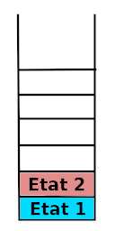
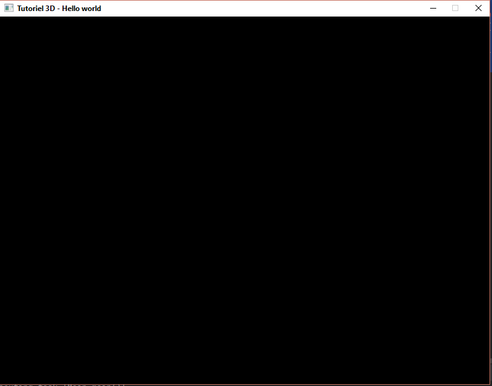
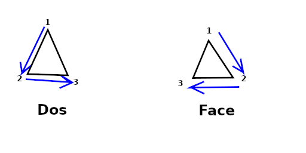

# Tutoriel sur la programmation de scènes 3D en Java via LWJGL

## Introduction

La 3D en informatique est la projection d'un monde en 3 dimensions sur un monde en 2 dimensions (l'écran de l'appreil comme un ordinateur, un téléphone, une tablette.)

Tout ce passe comme si on regardait ce monde à travers une fenêtre, c'est l'habitude de voir des perspectives, et un monde en 3D qui permet à notre cerveau de reconstituer l'effet de profondeur.

C'est une chose qui m'a frappée lors de l'écriture de mon premier moteur 3D à une époque ou avoir une carte 3D ou un chipset intégré capable d'en faire était un luxe.
A l'époque j'avais du tout faire en 100% Java. Fort heureusement pour vous désormais les cartes 3D existent partout désormais ce qui simplifiera grandement ce tutoriel vous évitant
des mathématiques sur la géométrie projective et des tas de problèmes de performances. Tout cela étant désormais géré par la carte 3D.

Il y aura tout de même un peu de mathématiques auxquels on ne peut y échapper.

Pour adresser la carte 3D et lui demander d'afficher ce que l'on veut, il existe deux interfaces, DirectX (Disponible uniquement pour Windows) et OpenGL (Disponible pour toutes les plateformes : Windows, Mac, Linux). 
OpenGL ES (Pour les mobiles et tablettes : Android, IOS). OpenGL ES, par rapport à OpenGL est plus léger, mais permet moins de choses en général.

Ces interfaces sont des conventions que les constructeurs de cartes 3D s'engagent a respecté lors de l'écriture de leur driver pour la carte 3D. 

Pour être compatible avec les 3 plateformes Windows, Mac et Linux nous passeront par OpenGL.

OpenGL reste assez bas niveau dans le sens, où on ne peut s'y adresser directement qu'à travers des library en C/C++. 

Fut une époque ou j'étais obligé de créé un binding en JNI pour OpenGL. Un binding est une traduction en Java, par exemple, des fonctions ede la librairie en C.
Puis à travers JNI (Java Native Interface), traduire chaque commande de Java vers C et chaque réponse de C vers Java.

Fort heureusement pour vous, tout ce travail et la gestion de la mémoire et des problèmes de pointeurs est déjà faite désormais.
Les binding les plus connus sont JOGL et LWJGL. Grace à eux, vous n'aurez pas à tapper une seule ligne en C/C++, ni du JNI.

J'ai choisi, LWJGL pour ce premier tutoriel, car il est un peu plus simple de déploiement que JOGL (Enfin c'était vrai la dernière fois où j'ai fait du JOGL).
 
Le site d'[OpenGL](https://www.khronos.org/registry/OpenGL-Refpages/gl2.1/) vous permettra d'avoir une liste les commandes OpenGL. 
Ce qui vous permettra de progresser en dehors de ce tutoriel, qui ne peut pas prétendre tout couvrir.

## Rappel sur les concepts de la 3D 

Nous allons présenter ici, des notions et des définitions propre à la 3D. 

### Le **frustum**

La vue 3D est faite à travers la fenêtre de l'écran. Comme dans la réalité, le champs s'agrandit plus les objets sont loin. Il sont bien entenud perça plus petit.
Le champ de vison peut être représenté par une pyramide tronquée appelée **frustum**


L'écran jaune sur le schéma sera la fenêtre sur laquelle sera dessinée la 3D. 
Les objets visibles à l'écran se trouvent dans le **frustum**.

Il y a une limite à la profondeur que l'on peut voir.

L'utilsateur est représenté ici par une caméra. 

Autre illustration plus imagée : 


### Le repère Euclidien

Comme dans la réalité, il y a 3 dimensions : 
* L'horizontale (orientée de gauche à droite), appelée l'axe des abscisses, noté X
* La verticale (orientée de bas en haut), appelée l'axe des ordonnées, noté Y
* La profondeur (orientée de trés loin devant l'observateur jusqu'à l'utilisateur), appelée l'axe des profondeurs, noté Z

Le point central est l'obersvateur.
* Les abscisses X négatives seront à gauche de l'observateur
* Les abscisses X positives seront à droite de l'observateur
* Les ordonnées Y négatives seront sous de l'observateur
* Les ordonnées Y positives seront au-dessus de l'observateur
* Les profondeurs Z négatives seront face à l'observateur
* Les profondeurs Z positives seront derrière l'observateur

Pour résumé :


L'obervateur se trouvant au centre de ce repère.

Un tel repère s'appel un repère Euclidien. 
Nom venant du mathématicien Euclide qui les a beaucoup étudiés dans ces travaux sur la géométrie traditionnelle.

Pour les plus exigeants, le repère est orthonormé. Orthonormé veut dire oerthogonal et normé :

* Un repère est orthogonal quand chaque axe fait un angle droit les uns part rapport aux autres
* Un repère est normé si sur ces axes on les découpe en interval réguliers pouvant ainsi avoir une graduation sur ceux-ci.
  Propriété nous permettant d'avoir des coordonnées, c'est-à-dire des valeurs pour X, Y et Z 

Avec les coordonnées (X, Y Z) on peut placer des points dans le rzpère.

En reliant les points on obtient des polygones.

Si on colorie l'ntérieur des contours polygones on obtient des faces.

Un objet 3D sera formé d'une ou plusieurs faces. 
  
### Les transformations

Placer des objets dans la 3D est bien, pouvoir les bouger est mieux.

Une transformation va changer de place un objet 3D, le changer de taille, voir le déformer.

Toute transformation peut être représentée par une matrice, mais il est plus simple, dans la pratique, de manipulation de découper entrnasformation de base.
 
À savoir qu'OpenGL vous permet les deux. Ici nous allons vous présenter les transformations des bases.
 
En les combinants on pourra faire tout ce dont nous avons besoin.

#### Translation

La translation est bougé un objet dans une direction donnée. On précise de combein en X, Y et Z de combien l'objet doit bouger. 
Ce triplet (X, Y, Z) est appelé un vecteur. 

C'est un peu comme si on disait à l'objet :

* Avec **X**, avance de tant de pas à droite (ou à gauche) 
* Avec **Y**, avance de tant de pas vers le haut (ou le bas)
* Avec **Z**, avance de tant de pas vers l'arrière (ou l'avant)

Les choix entre parenthèses sont pour les valeurs négatives de **X**, **Y** ou **Z** 

Ce qui peut être illustré par
 
 
 
Le cube bleu est l'objet que l'on bouge, la flèche verte, la direction qu'on veut qu'il prenne.

Dans la réalité le déplacement est "instantané"

#### Rotation 

La rotation est le fait de faire tourner un objet autour d'un axe virtuel. 
C'est comme si on avait une barre et que l'on décidait de tourner autour.


#### Changement d'échelle 

Le changement d'échelle ou "scale" en anglais, permet de changer le propotions d'un bjets.

C'est un peu comme si l'objet pouvait s'étire ou de compresser en X, Y et Z. 
Le facteur d'étirement ou de comprésion peut être différent selon l'axe. 


### La couleur

La représentation des couleurs sur un écrn est décomposées en trois couleurs de bases : le rouge, le vert et le bleu.

En jouant sur l'intensité des chaqu'une dde ces couleurs on obtient une très grande pallete de couleurs possible.

Sur les écrans modernes, on à 256 niveau de rouge, 256 de vert et 256 de bleu. Ce qui donne 256x256x256 = 16 777 216 couleurs possibles pour chaque pixel.

A ce triplet on ajoute un niveau de transparence. De complètement opaque à totalement transparent. 
Cette information n'est pas directement dessiner à l'écran, mais permet de caculer la couleur finale quand un objet semi transparent passe devant un autre.

Imaginez une vitre teintée de rouge, la scene derrière elle sera plus ou moins rougit selon la transparence de cette fenêtre.


# 3D et Java 

Le rendu 3D est calculée par la carte 3D. 
Pour que le rendu soit dessiné à l'écran dans une fenêtre, il faut demander à l'OS de réservé une fenêtre, 
à laquelle on demandera de dessiner le rendu calculé par la carte 3D.

Pour donner des instructions à la carte 3D, il faut un ou des drivers. Par dessus le/les drivers il y a une couche OpenGL.

L'OpenGL quand à lui est manipulé par un libraie en C/C++

Le C/C++ échange avec Java via JNI.

Par-dessus la couche Java vient notre code.


Sur le schéma, en jaune la partie gérée par LWJGL

On pourrait craindre que l'on perde des performances avec toutes ces couches que l'on doit traverser.
Mais en réalité :

1. On n'envoie que des instructions à la carte 3D, c'est elle qui fait tout le travail qui coute cher du caclul de rendu. 
   Que les instructions veinent de Java, ou directement du C, ca ne change rien au temps du calcul du rendu.
1. Que se soit JOGL ou LWJGL, un travail remarquable a été fait pour optimiser les échanges à travers la couche JNI. 
   Nous verrons plus loin comment en profiter au mieux.
1. Si on respecte le thread qui sera dédié au rendu et qu'il ne fait qu'une chose, envoyer des instructions, 
   il faudra une scene très complexe pour commencer à sentir des ralentissements (Que l'on aurait également en C).


## Informations sur l'OpenGL

### La machine à états

Le rendu fonctionne par frame. Une frame est le rendu à un instant donné. 
Comme une vidéo, le rendu n'est pas continu, mais en plusieurs images les une derrière les autres.
C'est le défilement rapide de ces images qui donne l'impression de continuité.

Pour le rendu, nous allons avoir une boucle qui à chaque tour va dessiner la nouvelle frame.
Si nous voulons que le rendu paraisse fluide, nous ayons intérêt à ce que ce rendu soit rapide et non pertubé par des événements extérieurs.
C'est pour cela que nous créerons un thread dédié à ce rendu qui ne fera qu'une chose le rendu OpenGL.
Tous les éventuels écouteurs, événements, seront gérés depuis des threads à part.
C'est pour cela, que nous allons faire en sorte que le développeur qui utilisera notre code n'est pas à intervenir dans le thread OpenGL. 

L'OpenGL fonctionne comme une machine à état. 
Ce qui veut dire que chaque instruction influence les suivantes.
Si on veut annuler l'éffet d'une instruction, il faut faire son instruction opposée.

La conséquence de cette machine à état, est que les effets peuvent s'accumler d'un tour de boucle sur l'autre.
C'est pour cela que nous ferons en sorte qu'un tour de boucle n'a pas d'influence sur son suivant.

### La pile des matrices

L'ordre des instructions est important, surtout quand il s'agit de cumuler des transformations afin de positionner et/ou déformer un objet.

Par exemple ce n'est pas la mê chose de tourner d'un quart de tour sur la droite, puis avancer de 3 mètres. 
Et avancé de 3 mètres, puis tourner d'un quart de tour sur la droite. 

Avec ce que nous avons dit, pour positionner un cube et une sphère, on ferait à chaque tour de boucle

1. Liste de transformations pour placer le cube
1. Dessiner le cube
1. Liste de transformations inverse de celles pour placer le cube 
1. Liste de transformations pour placer la sphère
1. Dessiner la sphère
1. Liste de transformations inverse de celles pour placer la sphère

La liste inverse des transformations, est assez pénible à gérée, heureusement l'OpenGL à un méchanisme pour simplifier cette gestion. 
Elle à de plus le mérite d'être plus rapide que de refaire le chemin inverse. 

Pour gérer la cumulation des transformations, l'OpenGL passe paar une matrice. 
Chaque transformation modifie la matrice courante. L'OpenGL se sert ensuite de cette matrice résultante pour placer les objets.

Il est possible de sauvegardé l'état de la matrice courante afin de la restaurée dans la pile des matrices.

Ainsi plus besoin de revenir en arrière, il suffit de sauvegarder l'état au quel on veut pouvoir retourner. 
De faire nos modifications, puis de restaurer la matrice. 

Pour notre example, il devient

1. Sauvegarde de la matrice actuelle
1. Liste de transformations pour placer le cube
1. Dessiner le cube
1. Restaurer la matrice sauvegardée
1. Sauvegarde de la matrice actuelle
1. Liste de transformations pour placer la sphère
1. Dessiner la sphère
1. Restaurer la matrice sauvegardée

La pile des matrices, s'apelle ainsi car ell fonctionne comme une pile en informatique. 
Cela permet de sauvegarder plusieurs états.

Illustrons ce comportement

Au départ la pile est vide


Ensuite on sauvegarde un état


Puis un autre



On remarque, que le second état est placé sur le premier. et à chaque sauvegarde, cela se comporte ainsi


et 


Quand on restaure une matrice, on restaure la matrice sen haut de la pile et cet état est enlever de la pile.

Dans notre schema une restauration va rétablir l'état 4 et la pile devient


Une autre restauration va rétablir l'état 3, en changeant la pile


A retenir

> Chaque sauvegarde met l'état courant de la matrice en haut de la pile
>
> Chaque restauration, restaure l'état de la matrice en haut de la pile et l'enlève de la pile.

L'intérêt d'un tel mécanisme est particulièrement intéressant lorsqu'un objet doit être placé par rapport à un autre.

Par exemple, si on souhaite dessiner une voiture, On va dessiner la carrosserie, puis chaque roue par rapport à la carrosserie.


1. Sauvegarde de la matrice principale <br/>
   
1. Placer la carrosserie
1. Dessiner la carrosserie
1. Sauvegarde de la matrice de la carrosserie <br/>
   
1. Placer la roue avant droite
1. Dessiner la roue avant droite
1. Restaurer la matrice de la carrosserie <br/>
   
1. Sauvegarde de la matrice de la carrosserie <br/> 
   
1. Placer la roue avant gauche
1. Dessiner la roue avant gauche
1. Restaurer la matrice de la carrosserie <br/>
   
1. Sauvegarde de la matrice de la carrosserie <br/> 
   
1. Placer la roue arrière droite
1. Dessiner la roue arrière droite
1. Restaurer la matrice de la carrosserie <br/> 
   
1. Sauvegarde de la matrice de la carrosserie <br/> 
   
1. Placer la roue arrière gauche
1. Dessiner la roue arrière gauche
1. Restaurer la matrice de la carrosserie  <br/> 
   
1. Restaurer la matrice principale  <br/> 
   

### Représentation des objets

Chaque objet est découpé en une ou plusieurs faces. Chaque face étant un polygone simple, souvent des triangles ou des trapezes.
bien que possible, il est rare d'utilisé des polygones de plus de quatre cotés. L'important est d'utilisé des polygones dit convexes.

Ce découpage en faces s'appelle une maille.

Pour simplifier la définition de convexes, c'est un polygone dont aucun coté ne se croisent et qui n'a pas de creux.

Exemples de polygones convexes


Exemples de polygones non convexes, appelés aussi concaves


Remarque
> Tous les triangles sont naturellement convexes
>
> Pour les polygones non convexes, on les découpe en plusieurs polygones convexes 

Pour les objets ronds, comme uu ballon, on va dessiner des faces suffisamment petites pour approximer l'objet, puis grace à l'éclairage donner l'illuson d'arrondi.
Nous parlerons plus tard de l'éclairage et de son fonctionnement.

Maille d'une sphère 


# Développement

## Créer un environnement de travail

La première chose à faire est de télécharger la version de LWJGL sous forme de zip sur leur Github : [LWJGL](https://github.com/LWJGL/lwjgl3/releases)

Une fois télécharger, dézipper le tout dans un dossier vide. Je vous conseille d'avoir un dossier ou il n'y a que ça dedans. Ca sera plus facile pour l'étape d'après.

Avec IntelliJ créez un projet Java : File -> New -> project ...


Puis sur : Next


Choisir un nom de projet, puis sur Finish

Maintenant il faut ajouter la librairie LWJGL à notre projet. Comme vous l'aurez remarqué, le zip de LWJGL contient tout un tas de dossiers.


Chaque dossier est une librairie que peut adresser LWJGL, ce qui permet de choisir ce que le projet à besoin.

Nous allons configurer notre projet pour se lier aux librairies nécessaire

Ce dont on a besoin pour le moment :

1. La librairie core, commune à toutes les autres, vous en aurez toujours besoin, quelque soi la librairie LWJGL que vous souhaitez utiliser.
   Elle se trouve dans le dossier : `lwjgl`
1. La librairie OpenGL, qui permet de communiquer avec la carte graphique via OpenGL : `lwjgl-opengl`
1. La librairie GLFW, qui va nous permettre d'afficher une fenêtre dans laquelle on affichera la 3D : `lwjgl-glfw`

Copions dans un dossier lib de notre projet les librairies ci-dessus citées :


Remarque:

> Afin de respecter l'open source, nous copions également les licences.
> Nous vous invitons à les lire afin de décider si vous êtes en accord avec celles-ci.
> La plupart vous laissent libre de l'utilisation, commerciale ou non.
> Elle empêche seulement qu'un tiers s'en réclame propriétaire.

Pour bien comprendre, ouvrons le dossier de la librairie core :


Remarque:

> Pratiquement tous les dossiers de chaque librairie ont la même structure.
 
On y voit le jar principal : `lwjgl.jar`, sa javadoc `lwjgl-javadoc.jar` et ces sources `lwjgl-sources.jar`

Les autres JARs qui commencent par `lwgj-natives` sont les libraries pour chaque plateforme. comme je vous l'ai di plus haut,
pour communiquer avec le materiel, on passe par des libraries en C/C++, ce qui implique l'utilisation du JNI. 
La partie C/C++ n'étant pas multiplateforme, il faut compiler une librairie pour chaque plateforme adressée. 
Bien sur c'est fait pour vous, mais vous devez les intégrer à votre programme. 
LWJGL à son lancement va détecter l'OS et déployer les bonnes libraries.

Maintenant que vous savez à quoi sert les JARs, configurons notre `build.gradle`

```groovy
dependencies {
    // LWJGL core
    implementation files("src/lib/core/lwjgl.jar")
    runtime files("src/lib/core/lwjgl-natives-linux.jar")
    runtime files("src/lib/core/lwjgl-natives-linux-arm32.jar")
    runtime files("src/lib/core/lwjgl-natives-linux-arm64.jar")
    runtime files("src/lib/core/lwjgl-natives-macos.jar")
    runtime files("src/lib/core/lwjgl-natives-windows.jar")
    runtime files("src/lib/core/lwjgl-natives-windows-x86.jar")

    // LWJGL OpenGL
    implementation files("src/lib/opengl/lwjgl-opengl.jar")
    runtime files("src/lib/opengl/lwjgl-opengl-natives-linux.jar")
    runtime files("src/lib/opengl/lwjgl-opengl-natives-linux-arm32.jar")
    runtime files("src/lib/opengl/lwjgl-opengl-natives-linux-arm64.jar")
    runtime files("src/lib/opengl/lwjgl-opengl-natives-macos.jar")
    runtime files("src/lib/opengl/lwjgl-opengl-natives-windows.jar")
    runtime files("src/lib/opengl/lwjgl-opengl-natives-windows-x86.jar")

    // LWJGL GLWF
    implementation files("src/lib/glfw/lwjgl-glfw.jar")
    runtime files("src/lib/glfw/lwjgl-glfw-natives-linux.jar")
    runtime files("src/lib/glfw/lwjgl-glfw-natives-linux-arm32.jar")
    runtime files("src/lib/glfw/lwjgl-glfw-natives-linux-arm64.jar")
    runtime files("src/lib/glfw/lwjgl-glfw-natives-macos.jar")
    runtime files("src/lib/glfw/lwjgl-glfw-natives-windows.jar")
    runtime files("src/lib/glfw/lwjgl-glfw-natives-windows-x86.jar")
```

Nous mettons en `implementation` les JARs nécessaire pour tapper le code et en `rumtime` ceux qui sont nécessaires seulement pendant l'éxécution du programme.

 Attention:

> Bien garder les noms des JARs contenant les librairies afin que LWJGL puisse faire son travail de déploiement des librairies adaptées à l'OS.

Penser à synchroniser les sources afin que les modifications faites dans le `build.gradle`se répercutent dans le projet.


Dans la dernière version d'IntelliJ, le bouton est un éléphant avec une roue bleue.

Au passage, parfois ce bouton n'est pas suffisant, dans ce cas, un **"clean"** puis un **"build"** complètent le rafraichissement


Maintenant que notre environment de travail est prêt on va pouvoir commencer des choses plus intéressantes.  

## Créer une fenêtre d'affichage pour nos scenes 3D

Nous allons créer et initialiser notre fenêtre et OpenGL pour accueillir nos futures scénes 3D.

Comme nous n'alons dit plus haut, le thread OpenGL est extrêmement important. 
Il doit s'y effectuer toutes les commandes OpenGL et seulement celles-ci afin de ne pas nuire à l'affichage.
Afin de se rappeler qu'une méthode s'exécute dans le Thread OpenGL, nous créons une annotation à mettre à la déclaration de ces méthodes

```java
package fr.developez.tutorial.java.dimension3.tool;

import java.lang.annotation.Documented;
import java.lang.annotation.ElementType;
import java.lang.annotation.Retention;
import java.lang.annotation.RetentionPolicy;
import java.lang.annotation.Target;

@Retention(RetentionPolicy.SOURCE)
@Target(ElementType.METHOD)
@Documented
public @interface ThreadOpenGL
{
}
``` 

### Fenêtre d'affichange

Avant de pouvoir afficher la 3D à l'écran, il nous faut une fenêtre dans laquelle celle-ci sera dessinée.
Nous allons donc commencè par créer cette fenêtre.

Pour cela nous allons utiliser `GLFW`

Une chose à comprendre sur le GLFW et l'OpenGL, c'est que le Thread qui va initialiser la fenêtre doit être le même que celui qui sera utilisé pour faire le rendu OpenGL.
Nous l'appeleront le Thread OpenGL.

Dans ce Thread on ne doit faire que du rendu, tous les listeners que nous appellerons seront dans un Thread à part.

Ceci est important pour garder la fluidité du rendu. Un développeur utilisant notre fenêtre, ne devra jamais pouvoir ou devoir utiliser ce Thread directement.
Cela évitera pas mal d'erreurs et des problèmes de rendu.

```java
package fr.developez.tutorial.java.dimension3.render;

import fr.developez.tutorial.java.dimension3.tool.NonNull;
import fr.developez.tutorial.java.dimension3.tool.Tools;
import fr.developez.tutorial.java.dimension3.tool.ThreadOpenGL;

public class Window3D
{
    public final  int                  width;
    public final  int                  height;
    public final  String               title;

    public Window3D(int width, int height, @NonNull String title)
    {
        Tools.checkNotNull("title", title);

        // Évitons les fenêtres trop petite
        this.width  = Math.max(128, width);
        this.height = Math.max(128, height);
        this.title  = title;

        // Création et lancement du Thread OpenGL
        (new Thread(this::startOpenGLThread)).start();
    }

    @ThreadOpenGL
    private void startOpenGLThread()
    {
        // TODO Initialiser la fenêtre, la lier à OpenGL, l'afficher, lancer le rendu         
    }
}
```

La première chose à faire est de capturé les erreurs GLFW pour avoir des informations en cas de problèmes. 
Pour le moment, redirigeons ces erreurs sur la console.

```java
// ... 
import org.lwjgl.glfw.GLFWErrorCallback;
import fr.developez.tutorial.java.dimension3.tool.ThreadOpenGL;
// ...

public class Window3D
{
    // ....

    @ThreadOpenGL
    private void startOpenGLThread()
    {
        // Capture les erreurs LWJGL et les affichent sur la consoles
        // Une gestion de erreurs différente est possible, mais sort du tutoriel d'introduction
        GLFWErrorCallback.createPrint(System.err)
                         .set();

        // TODO Initialiser la fenêtre, la lier à OpenGL, l'afficher, lancer le rendu         
    }
}
```

On doit ensuite initialiser GLFW:

```java
// ... 
import org.lwjgl.glfw.GLFWErrorCallback;
import org.lwjgl.glfw.GLFW;
import fr.developez.tutorial.java.dimension3.tool.ThreadOpenGL;
// ...

public class Window3D
{
    // ....

    @ThreadOpenGL
    private void startOpenGLThread()
    {
        // Capture les erreurs LWJGL et les affichent sur la consoles
        // Une gestion de erreurs différente est possible, mais sort du tutoriel d'introduction
        GLFWErrorCallback.createPrint(System.err)
                         .set();

        if (!GLFW.glfwInit())
        {
            // On désinscrit la gestion d'erreurs puisque nous ne pouvons pas continuer
            GLFW.glfwSetErrorCallback(null)
                .free();
            System.err.println("GLFW initialisation failed");
            return;
        }

        // TODO Initialiser la fenêtre, la lier à OpenGL, l'afficher, lancer le rendu         
    }
}
```

Nous allons ensuite configurer la fenêtre. 
GLFW va nous donner une reference sur cette fenêtre. 
Cette référence devra être utilisée pour communiquer avec la fenêtre. 
Nous devons donc garder cette référence.
Cette référence est sous la forme d'un `long`

Note (Pour les plus curieux) :
> Cette valuer est ce qu'on appelle une référence opaque. C'est-à-dire quelque chose qui n'a pas de sens en Java. 
> Le développeur Java n'a pas à se soucier de ce qu'elle signifie vraiment, mais doit la garder telle qu'elle.
>
> Rappelons-nous ce qui a été dit dans l'introduction, en réalité nous parlons à une librairie en C/C++.
> Notre fenêtre, à sa création, sera référencé par un pointeur sur une adresse mémoire.
> Le `long` est la valeur de cette adresse. Il faut un `long` pour une adresse mémoire compatible à une architecture 64 bits.
> Et comme qui peut le plus, peut le moins, ça marche aussi sur des architectures 32 bits.
> 
> Ici nous ne préoccupons pas de ces détails, mais c'est toujours intéressant de savoir d'où viennent les choses.

```java
// ... 
import org.lwjgl.glfw.GLFWErrorCallback;
import org.lwjgl.glfw.GLFW;
import fr.developez.tutorial.java.dimension3.tool.ThreadOpenGL;
// ...

public class Window3D
{
    // ...
    /**
     * Reference sur la fenêtre permettant à GLFW de la gréée
     */
    private       long                 window;
    // ....
    
    @ThreadOpenGL
    private void startOpenGLThread()
    {
        // Capture les erreurs LWJGL et les affichent sur la consoles
        // Une gestion de erreurs différente est possible, mais sort du tutoriel d'introduction
        GLFWErrorCallback.createPrint(System.err)
                         .set();

        if (!GLFW.glfwInit())
        {
            // On désinscrit la gestion d'erreurs puisque nous ne pouvons pas continuer
            GLFW.glfwSetErrorCallback(null)
                .free();
            System.err.println("GLFW initialisation failed");
            return;
        }

        // Configure GLFW
        GLFW.glfwDefaultWindowHints();
        // On empêche, pour le moment, que la fenêtre s'affiche afin d'avoir le temps de la configurée
        GLFW.glfwWindowHint(GLFW.GLFW_VISIBLE, GLFW.GLFW_FALSE);

        // La fenêtre aura un contour
        GLFW.glfwWindowHint(GLFW.GLFW_DECORATED, GLFW.GLFW_TRUE);
        // La fenêtre ne pourra pas être redimensionnée
        // Un redimensionnement obligerait à écouter le changement de taille et à y réagir.
        // Comme nous voulons faire simple, nous ne gérons pas ce cas tout de suite
        GLFW.glfwWindowHint(GLFW.GLFW_RESIZABLE, GLFW.GLFW_FALSE);
        // On veut que la fenêtre fasse aau plus proche possible la dimension demandée
        GLFW.glfwWindowHint(GLFW.GLFW_MAXIMIZED, GLFW.GLFW_FALSE);

        // Create de la fenêtre
        this.window = GLFW.glfwCreateWindow(this.width, this.height, this.title, MemoryUtil.NULL, MemoryUtil.NULL);

        if (this.window == MemoryUtil.NULL)
        {
            // La fenêtre n'a pas pu être réservée en mémoire, on ne peut pas continuer
            this.closeGLFW();
            System.err.println("GLFW can't create window");
            return;
        }


        // TODO Initialiser la fenêtre, la lier à OpenGL, l'afficher, lancer le rendu         
    }

    /**
     * Appeler à la sortie de la fenêtre pour nettoyer proprement les divers états
     */
    private void closeGLFW()
    {
        // Termine la gestion de la fenêtre par GLFW
        GLFW.glfwTerminate();
        // Arrête de tracker les erreurs
        GLFW.glfwSetErrorCallback(null)
            .free();
    }
}
```

Maintenant que notre référence est créée,nous allons ajouter un listener qui va réagir au plus important événement : 
La fermeture de la fenêtre, afin de bien libéré la mémoire.

Pour cela créons une classe qui va réagir aux événements de la fenêtre :

 ```java
 package fr.developez.tutorial.java.dimension3.render;
 
 import org.lwjgl.glfw.GLFW;
 import org.lwjgl.glfw.GLFWWindowCloseCallbackI;
 
 class Window3DCloseEventManager
         implements GLFWWindowCloseCallbackI
 {
     /**
      * Appeler au moment qu'une fenêtre est sur la point de se fermée
      * @param window Référence sur la fenêtre entrain de se fermée
      */
     @Override
     public void invoke(long window)
     {
         this.closeWidow(window);
     }
 
     /**
      * Gère la fermeture d'une fenêtre 
      * @param window Référence sur la fenêtre a fermée
      */
     void closeWidow(long window)
     {
         // Pour le moment on autorise la fenêtre à se fermée dans tous les cas
         GLFW.glfwSetWindowShouldClose(window, true);
     }
 }
```

Plus d'informations sur `glfwSetWindowShouldClose` :
Il s'aggit d'un flag qui permet d'autoriser ou non la fermeture de la fenêtre. 
Le mettre à `true`, comme ici, va permettre la fermeture de celle-ci. 

Dans certains cas il peut être utile de le mettre à `false`pour par exemple afficher une boîte de dialogue qui demande :
"Êtes-vous sur de vouloir quitter ?"

Nous nous servirons également de ce flag, pour savoir quand arrêter la boucle rendue OpenGL.

Maintenant, nous pouvons brancher notre listener de fermeture.

```java
// ...
import org.lwjgl.glfw.Callbacks;
import org.lwjgl.glfw.GLFW;
import org.lwjgl.glfw.GLFWErrorCallback;
import fr.developez.tutorial.java.dimension3.tool.ThreadOpenGL;
// ...
public class Window3D
{
    // ...
    /**
     * Reference sur la fenêtre permettant à GLFW de la géréée
     */
    private       long                      window;
    private final Window3DCloseEventManager window3DCloseEventManager = new Window3DCloseEventManager();
    // ...

    @ThreadOpenGL
    private void startOpenGLThread()
    {
        // Capture les erreurs LWJGL et les affichent sur la consoles
        // Une gestion de erreurs différente est possible, mais sort du tutoriel d'introduction
        GLFWErrorCallback.createPrint(System.err)
                         .set();

        if (!GLFW.glfwInit())
        {
            // On désinscrit la gestion d'erreurs puisque nous ne pouvons pas continuer
            GLFW.glfwSetErrorCallback(null)
                .free();
            System.err.println("GLFW initialisation failed");
            return;
        }

        // Configure GLFW
        GLFW.glfwDefaultWindowHints();
        // On empêche, pour le moment, que la fenêtre s'affiche afin d'avoir le temps de la configurée
        GLFW.glfwWindowHint(GLFW.GLFW_VISIBLE, GLFW.GLFW_FALSE);

        // La fenêtre aura un contour
        GLFW.glfwWindowHint(GLFW.GLFW_DECORATED, GLFW.GLFW_TRUE);
        // La fenêtre ne pourra pas être redimensionnée
        // Un redimensionnement obligerait à écouter le changement de taille et à y réagir.
        // Comme nous voulons faire simple, nous ne gérons pas ce cas tout de suite
        GLFW.glfwWindowHint(GLFW.GLFW_RESIZABLE, GLFW.GLFW_FALSE);
        // On veut que la fenêtre fasse aau plus proche possible la dimension demandée
        GLFW.glfwWindowHint(GLFW.GLFW_MAXIMIZED, GLFW.GLFW_FALSE);

        // Create de la fenêtre
        this.window = GLFW.glfwCreateWindow(this.width, this.height, this.title, MemoryUtil.NULL, MemoryUtil.NULL);

        if (this.window == MemoryUtil.NULL)
        {
            // La fenêtre n'a pas pu être réservée en mémoire, on ne peut pas continuer
            this.closeGLFW();
            System.err.println("GLFW can't create window");
            return;
        }

        // TODO : Insérer ici les listeners pour les événements souris, clavier et joystick

        // Management de la fermeture de la fenêtre pour libéré proprement la mémoire
        GLFW.glfwSetWindowCloseCallback(this.window, this.window3DCloseEventManager);
        
        // ...
    }
    
    public void closeWindow()
    {
        this.window3DCloseEventManager.closeWidow(this.window);
    }

    void exitWidow()
    {
        // On libère tous les listeners
        Callbacks.glfwFreeCallbacks(this.window);
        // On finalize la destruction de la fenêtre
        GLFW.glfwDestroyWindow(this.window);
        // On ferme les événements GLFW
        this.closeGLFW();
    }

    /**
     * Appeler à la sortie de la fenêtre pour nettoyer proprement les divers états
     */
    private void closeGLFW()
    {
        // Termine la gestion de la fenêtre par GLFW
        GLFW.glfwTerminate();
        // Arrête de tracker les erreurs
        GLFW.glfwSetErrorCallback(null)
            .free();
    }
}
```

Nous avons ajouté une méthode pour pouvoir fermer la fenêtre à partir du code, ainsi que préparée la fermeture propre de la fenêtre.

En appelant `closeWidow` du listener, on s'assure de pouvoir gérer la fermeture de la fenêtre toujours au même endroit.
Ce qui évitera de dupliquer du code le moment ou l'on voudra ajouter une logique plus complexe à la fermeture.

Il ne nous reste à attacher le rendu OpenGL à la fenêtre, et préparé la boucle de rendue.

Tout d'abbord attachons OpenGL et montrons la fenêtre :

```java
// ... 
import org.lwjgl.glfw.Callbacks;
import org.lwjgl.glfw.GLFW;
import org.lwjgl.glfw.GLFWErrorCallback;
import fr.developez.tutorial.java.dimension3.tool.ThreadOpenGL;
// ...
public class Window3D
{
    // ...
    /**
     * Reference sur la fenêtre permettant à GLFW de la géréée
     */
    private       long                      window;
    private final Window3DCloseEventManager window3DCloseEventManager = new Window3DCloseEventManager();
    // ...

    @ThreadOpenGL
    private void startOpenGLThread()
    {
        // Capture les erreurs LWJGL et les affichent sur la consoles
        // Une gestion de erreurs différente est possible, mais sort du tutoriel d'introduction
        GLFWErrorCallback.createPrint(System.err)
                         .set();

        if (!GLFW.glfwInit())
        {
            // On désinscrit la gestion d'erreurs puisque nous ne pouvons pas continuer
            GLFW.glfwSetErrorCallback(null)
                .free();
            System.err.println("GLFW initialisation failed");
            return;
        }

        // Configure GLFW
        GLFW.glfwDefaultWindowHints();
        // On empêche, pour le moment, que la fenêtre s'affiche afin d'avoir le temps de la configurée
        GLFW.glfwWindowHint(GLFW.GLFW_VISIBLE, GLFW.GLFW_FALSE);

        // La fenêtre aura un contour
        GLFW.glfwWindowHint(GLFW.GLFW_DECORATED, GLFW.GLFW_TRUE);
        // La fenêtre ne pourra pas être redimensionnée
        // Un redimensionnement obligerait à écouter le changement de taille et à y réagir.
        // Comme nous voulons faire simple, nous ne gérons pas ce cas tout de suite
        GLFW.glfwWindowHint(GLFW.GLFW_RESIZABLE, GLFW.GLFW_FALSE);
        // On veut que la fenêtre fasse aau plus proche possible la dimension demandée
        GLFW.glfwWindowHint(GLFW.GLFW_MAXIMIZED, GLFW.GLFW_FALSE);

        // Create de la fenêtre
        this.window = GLFW.glfwCreateWindow(this.width, this.height, this.title, MemoryUtil.NULL, MemoryUtil.NULL);

        if (this.window == MemoryUtil.NULL)
        {
            // La fenêtre n'a pas pu être réservée en mémoire, on ne peut pas continuer
            this.closeGLFW();
            System.err.println("GLFW can't create window");
            return;
        }

        // TODO : Insérer ici les listeners pour les événements souris, clavier et joystick

        // Management de la fermeture de la fenêtre pour libéré proprement la mémoire
        GLFW.glfwSetWindowCloseCallback(this.window, this.window3DCloseEventManager);
        
        // Associe le context OpenGL à la fenêtre
        GLFW.glfwMakeContextCurrent(this.window);
        // Activation du mode v-sync
        GLFW.glfwSwapInterval(1);

        // Maintenant que tout est configurer la fenêtre peut se montrée
        GLFW.glfwShowWindow(this.window);

        // Cette appel est crucial pour que la management d'OpenGL avec GLFW se passe bien
        GL.createCapabilities();

        // TODO Boucle de rendue
    }
}
```
 
 ### Boucle de rendue
 
 Le role de la boucle de rendue est dans l'ordre :
 1. Initialiser OpenGL avec les options que l'on désire utiliser
 1. Rafraichir l'affichage en boucle tant que le fenêtre est présente
 1. Quitter proprement l'application quand l'utilisateur demande la fermeture de la fenêtre
 
 Voici son état minimal :
  
  ```java
 package fr.developez.tutorial.java.dimension3.render;
 
 import fr.developez.tutorial.java.dimension3.tool.NonNull;
 import fr.developez.tutorial.java.dimension3.tool.Tools;
 import org.lwjgl.glfw.GLFW;
 import org.lwjgl.opengl.GL11;
 import fr.developez.tutorial.java.dimension3.tool.ThreadOpenGL;
 
 class Render3D
 {
     private final Window3D window3D;
     private final long     window;
 
     Render3D(@NonNull Window3D window3D, long window)
     {
         Tools.checkNotNull("window3D", window3D);
         this.window3D = window3D;
         this.window   = window;
     }
 
     @ThreadOpenGL
     public void rendering()
     {
         this.initialize3D();
 
         // Tant que la fenêtre est présente, rafraichir la 3D
         while (!GLFW.glfwWindowShouldClose(this.window))
         {
             // Nettoyage de la fenêtre en buffer pour la prochaine frame
             GL11.glClear(GL11.GL_COLOR_BUFFER_BIT | GL11.GL_DEPTH_BUFFER_BIT);
 
             // Dessine la frame courante
             this.drawScene();
 
             // Rend la fenêtre en buffer dessinée visible à l'écran
             GLFW.glfwSwapBuffers(this.window);
 
             // Récupération des événements fenêtre arrivée peandant le dessin de la frame.
             // Les listeners sur les événements claviers seront appelée par cette méthode
             GLFW.glfwPollEvents();
 
             // TODO traité les évènements survenus
         }
 
         // La fenêtre de rendu se ferme ou est fermée, on quitte tout proprement
         this.window3D.exitWidow();
     }
 
     @ThreadOpenGL
     private void initialize3D()
     {
         // TODO
     }
 
     /**
      * Dessine la scène 3D
      */
     @ThreadOpenGL
     private void drawScene()
     {
         // TODO
     }
 } 
 ```
 
 Explications:
 
 On remarque tout d'abbord que l'on boucle sur : `glfwWindowShouldClose`
 Ce qui permet d'arréter la boucle de rendue dès qu'une requête est faite.
 
 Pour comprendre le contenu de la boucle, il faut s'avaoir que le rendu à l'écran n'est, en réalité pas continu. 
 OpenGL passe par une technique dite de double buffer.
 
 Cette technique consiste à calculer l'image en mémoire, puis une fois prête l'affichée à l'écran. 
 Afin d'économisez de la mémoire (et du temps de création), il joue avec deux buffers. L'un afficher à l'écran, l'autre en mémoire.
 Et quand l'image en mémoire est prête, il échange les deux buffers. 
 
 À noter que les cartes plus performantes peuvent gérer plus de deux buffers, mais le principe reste le même.
 
 Ce qui fait que le buffer que l'on a pour travailler n'est pas un page vierge mais contient les informations d'un précédent calcul.
 C'est pour cela que la première chose que l'on fait est de tout nettoyer afin d'être sûr de ne pas avoir d'artéfacts des calculs précédents.
 On pourrait se demander pourquoi le buffer n'est pas nettoyer automatiquement. 
 En fait pour certains effets il peut être utile de ne pas le nettoyer ou seulement en partie.
  
 Un buffer contient non seulement les informations de couleur des pixels à dessiner, mais également des informations sur la profondeur calculées.
 C'est pour cela qu'ici on nettoie les informations de couleurs et de profondeur, avec `GL11.glClear(GL11.GL_COLOR_BUFFER_BIT | GL11.GL_DEPTH_BUFFER_BIT)`
 
 L'instruction `glfwSwapBuffers` permet de dire à la carte graphique que l'on a fini de dessiner et qu'elle peut échanger les buffers.
  
 `glfwPollEvents` va remplir les informations sur les événements survenu pendant le rendu, 
 ce qui nous sera utile quand nous réagiront aux événements souris, clavier, manette de jeu.
  
 À la fin de la boucle, on n'oublie pas de fermer proprement la fenêtre.  
 
 Il ne nous reste plus qu'a appeler notre boucle de rendu dans la fenêtre :
 
 ```java
 // ... 
 import org.lwjgl.glfw.Callbacks;
 import org.lwjgl.glfw.GLFW;
 import org.lwjgl.glfw.GLFWErrorCallback;
 import org.lwjgl.opengl.GL;
 import fr.developez.tutorial.java.dimension3.tool.ThreadOpenGL;
 // ...
 public class Window3D
 {
     // ...
     /**
      * Reference sur la fenêtre permettant à GLFW de la géréée
      */
     private       long                      window;
     private final Window3DCloseEventManager window3DCloseEventManager = new Window3DCloseEventManager();
     private       Render3D                  render3D;
  
     // ... 
     @ThreadOpenGL
     private void startOpenGLThread()
     {
         // Capture les erreurs LWJGL et les affichent sur la consoles
         // Une gestion de erreurs différente est possible, mais sort du tutoriel d'introduction
         GLFWErrorCallback.createPrint(System.err)
                          .set();
 
         if (!GLFW.glfwInit())
         {
             // On désinscrit la gestion d'erreurs puisque nous ne pouvons pas continuer
             GLFW.glfwSetErrorCallback(null)
                 .free();
             System.err.println("GLFW initialisation failed");
             return;
         }
 
         // Configure GLFW
         GLFW.glfwDefaultWindowHints();
         // On empêche, pour le moment, que la fenêtre s'affiche afin d'avoir le temps de la configurée
         GLFW.glfwWindowHint(GLFW.GLFW_VISIBLE, GLFW.GLFW_FALSE);
 
         // La fenêtre aura un contour
         GLFW.glfwWindowHint(GLFW.GLFW_DECORATED, GLFW.GLFW_TRUE);
         // La fenêtre ne pourra pas être redimensionnée
         // Un redimensionnement obligerait à écouter le changement de taille et à y réagir.
         // Comme nous voulons faire simple, nous ne gérons pas ce cas tout de suite
         GLFW.glfwWindowHint(GLFW.GLFW_RESIZABLE, GLFW.GLFW_FALSE);
         // On veut que la fenêtre fasse aau plus proche possible la dimension demandée
         GLFW.glfwWindowHint(GLFW.GLFW_MAXIMIZED, GLFW.GLFW_FALSE);
 
         // Create de la fenêtre
         this.window = GLFW.glfwCreateWindow(this.width, this.height, this.title, MemoryUtil.NULL, MemoryUtil.NULL);
 
         if (this.window == MemoryUtil.NULL)
         {
             // La fenêtre n'a pas pu être réservée en mémoire, on ne peut pas continuer
             this.closeGLFW();
             System.err.println("GLFW can't create window");
             return;
         }
 
         // TODO : Insérer ici les listeners pour les événements souris, clavier et joystick
 
         // Management de la fermeture de la fenêtre pour libéré proprement la mémoire
         GLFW.glfwSetWindowCloseCallback(this.window, this.window3DCloseEventManager);
 
         // Associe le context OpenGL à la fenêtre
         GLFW.glfwMakeContextCurrent(this.window);
         // Activation du mode v-sync
         GLFW.glfwSwapInterval(1);
 
         // Maintenant que tout est configurer la fenêtre peut se montrée
         GLFW.glfwShowWindow(this.window);
 
         // Cette appel est crucial pour que la management d'OpenGL avec GLFW se passe bien
         GL.createCapabilities();
 
         //Lancement du rendu OpenGL
         this.render3D = new Render3D(this, this.window);
         this.render3D.rendering();
     }
     // ...
 }
 ```
 
 Désormais tout est prêt pour l'affichage. Si on lance un "main" :
 
 ```java
 package fr.developez.tutorial.java.dimension3;
 
 import fr.developez.tutorial.java.dimension3.render.Window3D;
 
 public class Main
 {
     public static void main(String[] args)
     {
         final Window3D window3D = new Window3D(800, 600, "Tutoriel 3D - Hello world");
     }
 }
 ```
 
 On a une fenêtre vide noire prête à accueillir notre scène 3D :
 
 
 
 ### Initialisation de l'OpenGL 
 
 Cette initialization va nous permettre de régler les divers aspects généraux de notre 3.
 Comme la taille du frustum (voir l'introduction)
 
 
 
 Le rectangle dans la fenêtre où dessiner la 3D, ici toute la fenêtre. Mais grace à cela il est possible de montrer facilement plusieurs vues de la scène ou des différentes scénes.
 Cela sort du cadre du tutoriel.
 
 Afin de simplifier certains calculs, ce tutoriel fournit l'outil GLU (Récupéré de JOGL)
 
 ```java
 package fr.developez.tutorial.java.dimension3.render;
 
 import fr.developez.tutorial.java.dimension3.tool.GLU;
 import fr.developez.tutorial.java.dimension3.tool.NonNull;
 import fr.developez.tutorial.java.dimension3.tool.ThreadOpenGL;
 import fr.developez.tutorial.java.dimension3.tool.Tools;
 import org.lwjgl.glfw.GLFW;
 import org.lwjgl.opengl.GL11;
 import org.lwjgl.opengl.GL12;
 
 class Render3D
 {
     private final Window3D window3D;
     private final long     window;
 
     // ... 
 
     @ThreadOpenGL
     private void initialize3D()
     {
         final int width  = this.window3D.width;
         final int height = this.window3D.height;
 
         // *** Gestion de la transparence ***
         // On indique que l'on souhaite activé la tranparence
         GL11.glEnable(GL11.GL_ALPHA_TEST);
         // Spécification de la précision de la transparence
         GL11.glAlphaFunc(GL11.GL_GREATER, 0.01f);
         // Façon dont la transparence est calculée
         GL11.glBlendFunc(GL11.GL_SRC_ALPHA, GL11.GL_ONE_MINUS_SRC_ALPHA);
 
         /// *** Apparence globale ***
         // Les matériaux peuvent être colorés
         GL11.glEnable(GL11.GL_COLOR_MATERIAL);
         // Pour des raisons de performances, on désactive les textures de manière globale, on les activera au cas par cas
         GL11.glDisable(GL11.GL_TEXTURE_2D);
         // On active la possibilité de combiné des effets
         GL11.glEnable(GL11.GL_BLEND);
 
         // ** Réglage de la perspective  ***
         // On fixe le rectangle de la fenêtre où la 3D sera dessinée.
         // Ici on veut dessiner sur toute la fenêtre
         // Sur le "frustum", c'est la zone proche de l'utilisateur
         // S'appel aussi 'view port'
         GL11.glViewport(0, 0, width, height);
         // On veut une projection normalisée
         GL11.glEnable(GL11.GL_NORMALIZE);
 
         // Réglage de la projection
         GL11.glMatrixMode(GL11.GL_PROJECTION);
         GL11.glLoadIdentity();
         final double ratio = (double) width / (double) height;
         GLU.gluPerspective(45.0, ratio, 0.1, 5000.0);
         // Réglage du model de la vue
         GL11.glMatrixMode(GL11.GL_MODELVIEW);
         GL11.glLoadIdentity();
 
         // Au départ on met un écran blanc
         GL11.glClearColor(1f, 1f, 1f, 1f);
         //On active le test de profondeur
         GL11.glEnable(GL11.GL_DEPTH_TEST);
 
         // Active les face visible que d'un coté (Pour éviter de dessiner des choses qui seront toujours cachés)
         GL11.glEnable(GL11.GL_CULL_FACE);
         GL11.glCullFace(GL11.GL_FRONT);
 
         // Éclairage de base pour un effet agréable
         GL11.glLightModeli(GL11.GL_LIGHT_MODEL_LOCAL_VIEWER, GL11.GL_TRUE);
         GL11.glShadeModel(GL11.GL_SMOOTH);
         GL11.glLightModeli(GL12.GL_LIGHT_MODEL_COLOR_CONTROL, GL12.GL_SEPARATE_SPECULAR_COLOR);
         GL11.glLightModeli(GL11.GL_LIGHT_MODEL_TWO_SIDE, 1);
 
         // Active l'éclairage
         // GL11.glEnable(GL11.GL_LIGHTING);
     }
     // ...
 }
 ```
 
 L'important à comprendre dans cette initialization:
 * `GL11.glViewport(0, 0, width, height)` fixe le view port. c'est à sire la zone dans la fenêtre où la 3D sera dessinée. 
   Ici on prend toute la fenêtre.
 * `GLU.gluPerspective(45.0, ratio, 0.1, 5000.0)` va créer le frustum. 
   * La première valeur, correspond à l'angle que fait visuellement l'axe des Z par rapport à l'axz des X. 
     L'aspect le plus naturel est 45 dégré.
   * La seconde valeur est la proportion largeur par rapport à la hauteur.
     Ici réglée pour que les proportions soit homogènes.
   * La troisième valeur est la distance du plan le plus proche du frustum
   * La dernière valeur est la distance du plan le plus éloigné du frustum
 
 Une face a deux cotées, l'un dit de face, l'autre de dos. 
 Pour déterminer si une face est de face ou de dos, OpenGL regarde l'odre dans lequel sont spécifié les points du polygones.
 
 Si quand on les regarde, la definition des points spécifiés sont dans le sens des aiguilles d'une montre, alors on voit la face de la face.
 
 Si quand on les regarde, la definition des points spécifiés sont dans le sens contraire des aiguilles d'une montre, alors on voit le dos de la face.
 
  
 
 `GL11.glEnable(GL11.GL_CULL_FACE);`, indique que l'on souhaite distinguer le sens des face (savoir si on les regarde de face ou de dos)
 
 `GL11.glCullFace(GL11.GL_FRONT);`, indique de ne calculer et dessiner que les faces de face et ignorées celles de dos.
 
 L'intérêt de ce réglage est pour les objets dont on ne voit jamais l'intérieur comme les boîtes, les spheres, ...
 On évite ainsi qu'OpenGL calcule les faces intérieures qui seront de toute façons cachées par des faces extérieures.  
 
 Nous mettons, pour le moment `GL11.glEnable(GL11.GL_LIGHTING);` en commentaire afin de ne pas activer l'écairage.
 Quand nous auront appris comment l'écalirage fonctionne, nous réactiverons cette ligne

Désormais tout est prêt pour afficher de la 3D. 
Commençons par un [Hello world](HelloWorld.md) 
