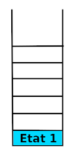
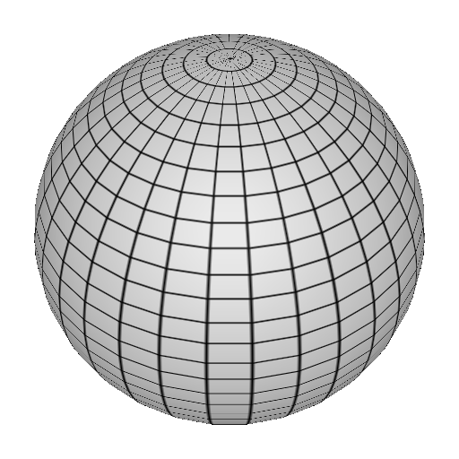

# Tutoriel sur la programmation de scènes 3D en Java via LWJGL

## Introduction sur la 3D

La 3D en informatique est la projection d'un monde en 3 dimensions sur un monde en 2 dimensions (l'écran de l'appreil comme un ordinateur, un téléphone, une tablette.)

Tout ce passe comme si on regardait ce monde à travers une fenêtre, c'est l'habitude de voir des perspectives, et un monde en 3D qui permet à notre cerveau de reconstituer l'effet de profondeur.

C'est une chose qui m'a frappée lors de l'écriture de mon premier moteur 3D à une époque ou avoir une carte 3D ou un chipset intégré capable d'en faire était un luxe.
A l'époque j'avais du tout faire en 100% Java. Fort heureusement pour vous désormais les cartes 3D existent partout désormais ce qui simplifiera grandement ce tutoriel vous évitant
des mathématiques sur la géométrie projective et des tas de problèmes de performances. Tout cela étant désormais géré par la carte 3D.

Il y aura tout de même un peu de mathématiques auxquels on ne peut y échapper.

Pour adresser la carte 3D et lui demander d'afficher ce que l'on veut, il existe deux interfaces, DirectX (Disponible uniquement pour Windows) et OpenGL (Disponible pour toutes les plateformes : Windows, Mac, Linux). 
OpenGL ES (Pour les mobiles et tablettes : Android, IOS). OpenGL ES, par rapport à OpenGL est plus léger, mais permet moins de choses en général.

Ces interfaces sont des conventions que les constructeurs de cartes 3D s'engagent a respecté lors de l'écriture de leur driver pour la carte 3D. 

Pour être compatible avec les 3 plateformes Windows, Mac et Linux nous passeront par OpenGL.

OpenGL reste assez bas niveau dans le sens, où on ne peut s'y adresser directement qu'à travers des library en C/C++. 

Fut une époque ou j'étais obligé de créé un binding en JNI pour OpenGL. Un binding est une traduction en Java, par exemple, des fonctions ede la librairie en C.
Puis à travers JNI (Java Native Interface), traduire chaque commande de Java vers C et chaque réponse de C vers Java.

Fort heureusement pour vous, tout ce travail et la gestion de la mémoire et des problèmes de pointeurs est déjà faite désormais.
Les binding les plus connus sont JOGL et LWJGL. Grace à eux, vous n'aurez pas à tapper une seule ligne en C/C++, ni du JNI.

J'ai choisi, LWJGL pour ce premier tutoriel, car il est un peu plus simple de déploiement que JOGL (Enfin c'était vrai la dernière fois où j'ai fait du JOGL).
 
Le site d'[OpenGL](https://www.khronos.org/registry/OpenGL-Refpages/gl2.1/) vous permettra d'avoir une liste les commandes OpenGL. 
Ce qui vous permettra de progresser en dehors de ce tutoriel, qui ne peut pas prétendre tout couvrir.


## Informations basiques sur la 3D

Nous allons présenter ici, des notions et des définitions propre à la 3D. 

### Le **frustum**

La vue 3D est faite à travers la fenêtre de l'écran. Comme dans la réalité, le champs s'agrandit plus les objets sont loin. Il sont bien entenud perça plus petit.
Le champ de vison peut être représenté par une pyramide tronquée appelée **frustum**


L'écran jaune sur le schéma sera la fenêtre sur laquelle sera dessinée la 3D. 
Les objets visibles à l'écran se trouvent dans le **frustum**.

Il y a une limite à la profondeur que l'on peut voir.

L'utilsateur est représenté ici par une caméra. 

Autre illustration plus imagée : 


### Le repère Euclidien

Comme dans la réalité, il y a 3 dimensions : 
* L'horizontale (orientée de gauche à droite), appelée l'axe des abscisses, noté X
* La verticale (orientée de bas en haut), appelée l'axe des ordonnées, noté Y
* La profondeur (orientée de trés loin devant l'observateur jusqu'à l'utilisateur), appelée l'axe des profondeurs, noté Z

Le point central est l'obersvateur.
* Les abscisses X négatives seront à gauche de l'observateur
* Les abscisses X positives seront à droite de l'observateur
* Les ordonnées Y négatives seront sous de l'observateur
* Les ordonnées Y positives seront au-dessus de l'observateur
* Les profondeurs Z négatives seront face à l'observateur
* Les profondeurs Z positives seront derrière l'observateur

Pour résumé :


L'obervateur se trouvant au centre de ce repère.

Un tel repère s'appel un repère Euclidien. 
Nom venant du mathématicien Euclide qui les a beaucoup étudiés dans ces travaux sur la géométrie traditionnelle.

Pour les plus exigeants, le repère est orthonormé. Orthonormé veut dire oerthogonal et normé :

* Un repère est orthogonal quand chaque axe fait un angle droit les uns part rapport aux autres
* Un repère est normé si sur ces axes on les découpe en interval réguliers pouvant ainsi avoir une graduation sur ceux-ci.
  Propriété nous permettant d'avoir des coordonnées, c'est-à-dire des valeurs pour X, Y et Z 

Avec les coordonnées (X, Y Z) on peut placer des points dans le rzpère.

En reliant les points on obtient des polygones.

Si on colorie l'ntérieur des contours polygones on obtient des faces.

Un objet 3D sera formé d'une ou plusieurs faces. 
  
### Les transformations

Placer des objets dans la 3D est bien, pouvoir les bouger est mieux.

Une transformation va changer de place un objet 3D, le changer de taille, voir le déformer.

Toute transformation peut être représentée par une matrice, mais il est plus simple, dans la pratique, de manipulation de découper entrnasformation de base.
 
À savoir qu'OpenGL vous permet les deux. Ici nous allons vous présenter les transformations des bases.
 
En les combinants on pourra faire tout ce dont nous avons besoin.

#### Translation

La translation est bougé un objet dans une direction donnée. On précise de combein en X, Y et Z de combien l'objet doit bouger. 
Ce triplet (X, Y, Z) est appelé un vecteur. 

C'est un peu comme si on disait à l'objet :

* Avec **X**, avance de tant de pas à droite (ou à gauche) 
* Avec **Y**, avance de tant de pas vers le haut (ou le bas)
* Avec **Z**, avance de tant de pas vers l'arrière (ou l'avant)

Les choix entre parenthèses sont pour les valeurs négatives de **X**, **Y** ou **Z** 

Ce qui peut être illustré par
 
 
 
Le cube bleu est l'objet que l'on bouge, la flèche verte, la direction qu'on veut qu'il prenne.

Dans la réalité le déplacement est "instantané"

#### Rotation 

La rotation est le fait de faire tourner un objet autour d'un axe virtuel. 
C'est comme si on avait une barre et que l'on décidait de tourner autour.


#### Changement d'échelle 

Le changement d'échelle ou "scale" en anglais, permet de changer le propotions d'un bjets.

C'est un peu comme si l'objet pouvait s'étire ou de compresser en X, Y et Z. 
Le facteur d'étirement ou de comprésion peut être différent selon l'axe. 


#### La couleur

La représentation des couleurs sur un écrn est décomposées en trois couleurs de bases : le rouge, le vert et le bleu.

En jouant sur l'intensité des chaqu'une dde ces couleurs on obtient une très grande pallete de couleurs possible.

Sur les écrans modernes, on à 256 niveau de rouge, 256 de vert et 256 de bleu. Ce qui donne 256x256x256 = 16 777 216 couleurs possibles pour chaque pixel.

A ce triplet on ajoute un niveau de transparence. De complètement opaque à totalement transparent. 
Cette information n'est pas directement dessiner à l'écran, mais permet de caculer la couleur finale quand un objet semi transparent passe devant un autre.

Imaginez une vitre teintée de rouge, la scene derrière elle sera plus ou moins rougit selon la transparence de cette fenêtre.


## Informations sur l'OpenGL

### La machine à états

Le rendu fonctionne par frame. Une frame est le rendu à un instant donné. 
Comme une vidéo, le rendu n'est pas continu, mais en plusieurs images les une derrière les autres.
C'est le défilement rapide de ces images qui donne l'impression de continuité.

Pour le rendu, nous allons avoir une boucle qui à chaque tour va dessiner la nouvelle frame.
Si nous voulons que le rendu paraisse fluide, nous ayons intérêt à ce que ce rendu soit rapide et non pertubé par des événements extérieurs.
C'est pour cela que nous créerons un thread dédié à ce rendu qui ne fera qu'une chose le rendu OpenGL.
Tous les éventuels écouteurs, événements, seront gérés depuis des threads à part.
C'est pour cela, que nous allons faire en sorte que le développeur qui utilisera notre code n'est pas à intervenir dans le thread OpenGL. 

L'OpenGL fonctionne comme une machine à état. 
Ce qui veut dire que chaque instruction influence les suivantes.
Si on veut annuler l'éffet d'une instruction, il faut faire son instruction opposée.

La conséquence de cette machine à état, est que les effets peuvent s'accumler d'un tour de boucle sur l'autre.
C'est pour cela que nous ferons en sorte qu'un tour de boucle n'a pas d'influence sur son suivant.

### La pile des matrices

L'ordre des instructions est important, surtout quand il s'agit de cumuler des transformations afin de positionner et/ou déformer un objet.

Par exemple ce n'est pas la mê chose de tourner d'un quart de tour sur la droite, puis avancer de 3 mètres. 
Et avancé de 3 mètres, puis tourner d'un quart de tour sur la droite. 

Avec ce que nous avons dit, pour positionner un cube et une sphère, on ferait à chaque tour de boucle

1. Liste de transformations pour placer le cube
1. Dessiner le cube
1. Liste de transformations inverse de celles pour placer le cube 
1. Liste de transformations pour placer la sphère
1. Dessiner la sphère
1. Liste de transformations inverse de celles pour placer la sphère

La liste inverse des transformations, est assez pénible à gérée, heureusement l'OpenGL à un méchanisme pour simplifier cette gestion. 
Elle à de plus le mérite d'être plus rapide que de refaire le chemin inverse. 

Pour gérer la cumulation des transformations, l'OpenGL passe paar une matrice. 
Chaque transformation modifie la matrice courante. L'OpenGL se sert ensuite de cette matrice résultante pour placer les objets.

Il est possible de sauvegardé l'état de la matrice courante afin de la restaurée dans la pile des matrices.

Ainsi plus besoin de revenir en arrière, il suffit de sauvegarder l'état au quel on veut pouvoir retourner. 
De faire nos modifications, puis de restaurer la matrice. 

Pour notre example, il devient

1. Sauvegarde de la matrice actuelle
1. Liste de transformations pour placer le cube
1. Dessiner le cube
1. Restaurer la matrice sauvegardée
1. Sauvegarde de la matrice actuelle
1. Liste de transformations pour placer la sphère
1. Dessiner la sphère
1. Restaurer la matrice sauvegardée

La pile des matrices, s'apelle ainsi car ell fonctionne comme une pile en informatique. 
Cela permet de sauvegarder plusieurs états.

Illustrons ce comportement

Au départ la pile est vide


Ensuite on sauvegarde un état



Puis un autre


On remarque, que le second état est placé sur le premier. et à chaque sauvegarde, cela se comporte ainsi


et 


Quand on restaure une matrice, on restaure la matrice sen haut de la pile et cet état est enlever de la pile.

Dans notre schema une restauration va rétablir l'état 4 et la pile devient


Une autre restauration va rétablir l'état 3, en changeant la pile


A retenir

> Chaque sauvegarde met l'état courant de la matrice en haut de la pile
>
> Chaque restauration, restaure l'état de la matrice en haut de la pile et l'enlève de la pile.

L'intérêt d'un tel mécanisme est particulièrement intéressant lorsqu'un objet doit être placé par rapport à un autre.

Par exemple, si on souhaite dessiner une voiture, On va dessiner la carrosserie, puis chaque roue par rapport à la carrosserie.


1. Sauvegarde de la matrice principale <br/>
   
1. Placer la carrosserie
1. Dessiner la carrosserie
1. Sauvegarde de la matrice de la carrosserie <br/>
   
1. Placer la roue avant droite
1. Dessiner la roue avant droite
1. Restaurer la matrice de la carrosserie <br/>
   
1. Sauvegarde de la matrice de la carrosserie <br/> 
   
1. Placer la roue avant gauche
1. Dessiner la roue avant gauche
1. Restaurer la matrice de la carrosserie <br/>
   
1. Sauvegarde de la matrice de la carrosserie <br/> 
   
1. Placer la roue arrière droite
1. Dessiner la roue arrière droite
1. Restaurer la matrice de la carrosserie <br/> 
   
1. Sauvegarde de la matrice de la carrosserie <br/> 
   
1. Placer la roue arrière gauche
1. Dessiner la roue arrière gauche
1. Restaurer la matrice de la carrosserie  <br/> 
   
1. Restaurer la matrice principale  <br/> 
   

### Représentation des objets

Chaque objet est découpé en une ou plusieurs faces. Chaque face étant un polygone simple, souvent des triangles ou des trapezes.
bien que possible, il est rare d'utilisé des polygones de plus de quatre cotés. L'important est d'utilisé des polygones dit convexes.

Ce découpage en faces s'appelle une maille.

Pour simplifier la définition de convexes, c'est un polygone dont aucun coté ne se croisent et qui n'a pas de creux.

Exemples de polygones convexes


Exemples de polygones non convexes, appelés aussi concaves


Remarque
> Tous les triangles sont naturellement convexes
>
> Pour les polygones non convexes, on les découpe en plusieurs polygones convexes 

Pour les objets ronds, comme uu ballon, on va dessiner des faces suffisamment petites pour approximer l'objet, puis grace à l'éclairage donner l'illuson d'arrondi.
Nous parlerons plus tard de l'éclairage et de son fonctionnement.

Maille d'une sphère 



Assez de théorie pour le moment et passons à la pratique de tout ceci

## Créer un environnement de travail

La première chose à faire est de télécharger la version de LWJGL sous forme de zip sur leur Github : [LWJGL](https://github.com/LWJGL/lwjgl3/releases)

Une fois télécharger, dézipper le tout dans un dossier vide. Je vous conseille d'avoir un dossier ou il n'y a que ça dedans. Ca sera plus facile pour l'étape d'après.

Avec IntelliJ créez un projet Java : File -> New -> project ...


Puis sur : Next


Choisir un nom de projet, puis sur Finish

Maintenant il faut ajouter la librairie LWJGL à notre projet. Comme vous l'aurez remarqué, le zip de LWJGL contient tout un tas de dossiers.


Chaque dossier est une librairie que peut adresser LWJGL, ce qui permet de choisir ce que le projet à besoin.

Nous allons configurer notre projet pour se lier aux librairies nécessaire

Ce dont on a besoin pour le moment :

1. La librairie core, commune à toutes les autres, vous en aurez toujours besoin, quelque soi la librairie LWJGL que vous souhaitez utiliser.
   Elle se trouve dans le dossier : `lwjgl`
1. La librairie OpenGL, qui permet de communiquer avec la carte graphique via OpenGL : `lwjgl-opengl`
1. La librairie GLFW, qui va nous permettre d'afficher une fenêtre dans laquelle on affichera la 3D : `lwjgl-glfw`

Copions dans un dossier lib de notre projet les librairies ci-dessus citées :


Remarque:

> Afin de respecter l'open source, nous copions également les licences.
> Nous vous invitons à les lire afin de décider si vous êtes en accord avec celles-ci.
> La plupart vous laissent libre de l'utilisation, commerciale ou non.
> Elle empêche seulement qu'un tiers s'en réclame propriétaire.

Pour bien comprendre, ouvrons le dossier de la librairie core :


Remarque:

> Pratiquement tous les dossiers de chaque librairie ont la même structure.
 
On y voit le jar principal : `lwjgl.jar`, sa javadoc `lwjgl-javadoc.jar` et ces sources `lwjgl-sources.jar`

Les autres JARs qui commencent par `lwgj-natives` sont les libraries pour chaque plateforme. comme je vous l'ai di plus haut,
pour communiquer avec le materiel, on passe par des libraries en C/C++, ce qui implique l'utilisation du JNI. 
La partie C/C++ n'étant pas multiplateforme, il faut compiler une librairie pour chaque plateforme adressée. 
Bien sur c'est fait pour vous, mais vous devez les intégrer à votre programme. 
LWJGL à son lancement va détecter l'OS et déployer les bonnes libraries.

Maintenant que vous savez à quoi sert les JARs, configurons notre `build.gradle`

```groovy
dependencies {
    // LWJGL core
    implementation files("src/lib/core/lwjgl.jar")
    runtime files("src/lib/core/lwjgl-natives-linux.jar")
    runtime files("src/lib/core/lwjgl-natives-linux-arm32.jar")
    runtime files("src/lib/core/lwjgl-natives-linux-arm64.jar")
    runtime files("src/lib/core/lwjgl-natives-macos.jar")
    runtime files("src/lib/core/lwjgl-natives-windows.jar")
    runtime files("src/lib/core/lwjgl-natives-windows-x86.jar")

    // LWJGL OpenGL
    implementation files("src/lib/opengl/lwjgl-opengl.jar")
    runtime files("src/lib/opengl/lwjgl-opengl-natives-linux.jar")
    runtime files("src/lib/opengl/lwjgl-opengl-natives-linux-arm32.jar")
    runtime files("src/lib/opengl/lwjgl-opengl-natives-linux-arm64.jar")
    runtime files("src/lib/opengl/lwjgl-opengl-natives-macos.jar")
    runtime files("src/lib/opengl/lwjgl-opengl-natives-windows.jar")
    runtime files("src/lib/opengl/lwjgl-opengl-natives-windows-x86.jar")

    // LWJGL GLWF
    implementation files("src/lib/glfw/lwjgl-glfw.jar")
    runtime files("src/lib/glfw/lwjgl-glfw-natives-linux.jar")
    runtime files("src/lib/glfw/lwjgl-glfw-natives-linux-arm32.jar")
    runtime files("src/lib/glfw/lwjgl-glfw-natives-linux-arm64.jar")
    runtime files("src/lib/glfw/lwjgl-glfw-natives-macos.jar")
    runtime files("src/lib/glfw/lwjgl-glfw-natives-windows.jar")
    runtime files("src/lib/glfw/lwjgl-glfw-natives-windows-x86.jar")
```

Nous mettons en `implementation` les JARs nécessaire pour tapper le code et en `rumtime` ceux qui sont nécessaires seulement pendant l'éxécution du programme.

 Attention:

> Bien garder les noms des JARs contenant les librairies afin que LWJGL puisse faire son travail de déploiement des librairies adaptées à l'OS.

Penser à synchroniser les sources afin que les modifications faites dans le `build.gradle`se répercutent dans le projet.


Dans la dernière version d'IntelliJ, le bouton est un éléphant avec une roue bleue.

Au passage, parfois ce bouton n'est pas suffisant, dans ce cas, un **"clean"** puis un **"build"** complètent le rafraichissement


Maintenant que notre environment de travail est prêt on va pouvoir commencer des choses plus intéressantes.  

Rendez-vous à la partie "Hello world" afin de créer une fenêtre d'affichage que nous utiliserons ensuite tout du long de ce tutoriel.

[Hello world](HelloWorld.md)
 
 